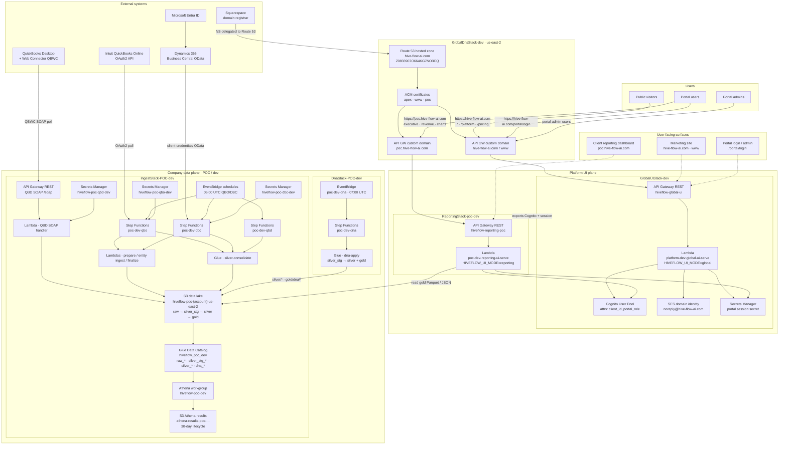

# Platform Architecture (Current State)

How HiveFlowAI / hiveflow is deployed today: AWS stacks, domains, connectors, and user-facing surfaces.

**Audience:** Internal product and engineering. Not customer-facing.

**Scope:** Reflects the **dev / POC** deployment driven by `config.yaml` and CDK stacks under `infra/`. Product brand is **HiveFlowAI**; repo/package is **hiveflow**.

## Product framing — DMaaS

**DMaaS (Data Model as a Service)** is the overall product container. It is a cloud service that exposes a fully built, governed, continuously updated semantic data model (dimensions, facts, relationships, metrics) through APIs so applications, BI tools, and AI agents can consume structured meaning without building the model themselves.

Inside DMaaS:

| Capability | Role |
|---|---|
| **Connect** | Land source systems (Business Central, QuickBooks Online, QuickBooks Desktop) into the lake |
| **DNA Engine** | Process owners tailor the semantic model in plain language; approved logic is pinned |
| **Reporting Engine** | Natural-language reports and portal layouts bound to certified DNA metrics |

Scheduled refresh updates **data** inside the model. Semantic and layout code change only when DNA or reporting packs are promoted.

**Companion docs:**

- [data-lake-architecture.md](./internal-execution-scoping/data-lake-architecture.md) — bronze / silver / gold lake design
- [dna-semantic-engine.md](./internal-execution-scoping/dna-semantic-engine.md) — DNA packs → gold → portal
- [bc-source-documentation-lambdas.md](./bc-source-documentation-lambdas.md) — BC MS Learn source-docs scrape / relationships / tags
- [hive-flow-ai-domain.md](./onboarding/hive-flow-ai-domain.md) — Squarespace ↔ Route 53 ↔ UI/DNS stack split
- [pre-launch-checklist.md](./business-admin/pre-launch-checklist.md) — infra provisioning checklist

---

## System diagram



---

## CDK stacks

| Stack | Module | Role |
|---|---|---|
| **IngestStack-POC-dev** | `infra/stacks/ingest_stack.py` | Data lake S3, connector Lambdas / Step Functions / EventBridge, QBD SOAP API, Glue, Athena |
| **GlobalDnaStack-dev** | `infra/stacks/global_dna_stack.py` | Global BC MS Learn source-docs scrape / relationships / tags |
| **DnaStack-POC-dev** | `infra/stacks/dna_stack.py` | DNA publish + per-client source-docs gold merge |
| **GlobalUiStack-dev** | `infra/stacks/global_ui_stack.py` | Public site, Cognito, SES, session secret |
| **ReportingStack-poc-dev** | `infra/stacks/reporting_stack.py` | Per-client reporting UI driven by `{company}_reporting_config`; seeds reporting sidecar on deploy; shares Cognito from GlobalUi |
| **GlobalDnsStack-dev** | `infra/stacks/global_dns_stack.py` | Route 53, ACM, API Gateway custom domains (when `manage_dns: true`) |

CDK entry: `infra/app.py`. Scopes: `all` | `ingest` | `platform` (`HIVEFLOW_CDK_SCOPE` / `-c scope=`).

**Not in current design:** CloudFront, DynamoDB, SQS, SNS, Kinesis.

---

## User-facing surfaces

| Surface | URL | Stack |
|---|---|---|
| Marketing / public site | `https://hive-flow-ai.com/`, `www` | GlobalUiStack |
| Portal login / admin | `https://hive-flow-ai.com/portal/login` | GlobalUiStack |
| Client reporting dashboard | `https://poc.hive-flow-ai.com/` | ReportingStack-poc |
| QBD SOAP (ops) | stack output `QbdSoapUrl` (`…/prod/soap`) | IngestStack |

App code: `packages/hiveflow-portal/packages/hiveflow-portal/src/hiveflow/dna/web/` (Werkzeug WSGI → `aws-wsgi` on Lambda).

---

## External systems

| System | Relationship |
|---|---|
| **Squarespace** | Registrar for `hive-flow-ai.com`. NS delegated to Route 53; does not host the live site once delegated. |
| **Intuit QuickBooks Online** | OAuth2 → bronze ingest (`qbo`) |
| **QuickBooks Desktop + QBWC** | SOAP poll → QBD Lambda via API Gateway `/soap` |
| **Microsoft Entra ID + Business Central** | Client-credentials OData → bronze ingest (`dbc`) |

---

## Data flow

### Lake layout (company bucket)

```text
s3://hiveflow-{company}-{account}-{region}/
  raw/{qbo|qbd|dbc}/{run_id}/{entity}/data.parquet + manifest
  silver_stg/{source}/{entity}/data.parquet
  silver/{source}/{entity}/data.parquet
  gold/dna/_staging/...
  gold/dna/{output_id}/data.parquet
  governance/{company}_dna_config/workflow.json
  governance/{company}_dna_config/v{semver}/{company}_dna_config.yaml
  governance/{company}_dna_config/v{semver}/{company}_reporting_config.yaml
  governance/{company}_dna_config/v{semver}/sql/manifest.yaml
  governance/{company}_dna_config/v{semver}/sql/silver/*.sql
  governance/{company}_dna_config/v{semver}/sql/gold/*.sql
  governance/{company}_dna_config/v{semver}/docs/...
  governance/{company}_dna_config/v{semver}/manifest.json
```

**Layer contract (KPI Generator / Athena SQL packs):**

| Change | Layer | Runs when |
|---|---|---|
| Derived **column** adds on an existing entity | **silver** (`sql/silver/*`) | DNA refresh (07:00); reads `silver_stg_*`, writes `silver/` |
| New **fact/dim/cube** tables and **KPIs** | **gold** (`sql/gold/*`) | DNA refresh (07:00); reads DNA `silver_*` |

Approved SQL is pinned by governance semver and replayed **verbatim** on schedule (no AI on refresh). Portal workflow: generate → save draft → review → approve. See [kpi-generator.md](./kpi-generator.md).

**Cutover (existing lakes):** run `python scripts/copy_silver_to_silver_stg.py` to copy `silver/` → `silver_stg/` (does not delete `silver/`). Deploy IngestStack, then DnaStack, then run DNA refresh once so DNA `silver/` and `gold/dna/` are rewritten.

### Connector refresh (IngestStack)

```text
EventBridge cron
  → Step Functions {company}-{env}-{connector}
      → [QBO/DBC] prepare → Map(entity ingest) → finalize
      → [QBD] skip bronze (QBWC already wrote raw)
      → silver consolidate Glue job (writes silver_stg only)
```

### DNA refresh (DnaStack)

```text
EventBridge {company}-{env}-dna
  → Step Functions DNA refresh
      → Glue dna-apply (2h)
           · copy pack-referenced silver_stg entities → silver (SQL targets + gold sources)
           · drop unused silver/ prefixes and Glue silver_* tables
           · pinned Athena silver SQL (column adds from silver_stg_*)
           · if pinned sql/gold present: Athena gold materialize
           · else: legacy Python compile → validate → publish
           · write gold/dna/manifest.json (pack_version + silver_sql_pack_version)
  → writes silver/{pack entities} and gold/dna/* ; Glue catalog updates
```

### UI read path

```text
Browser → Route 53 → API Gateway custom domain → Lambda
  Global: public pages + Cognito login/admin
  Reporting: Cognito session cookie → read gold from company S3
```

---

## Config anchors (`config.yaml`)

| Key | Value (dev) |
|---|---|
| Region | `us-east-2` |
| Zone / primary | `hive-flow-ai.com` |
| Hosted zone ID | `Z0833907O664KG7NO3CQ` |
| Portal client | `poc` → `poc.hive-flow-ai.com` |
| DNA source / pack | `dbc` / `{company}_dna_config` + `{company}_reporting_config` |
| Connector schedules | QBO/DBC 06:00 UTC; DNA 07:00 UTC |
| SES from | `noreply@hive-flow-ai.com` |

Routine UI deploys keep `manage_dns: false`. Deploy **GlobalDnsStack** only for DNS bootstrap or recovery — see [hive-flow-ai-domain.md](./onboarding/hive-flow-ai-domain.md).
