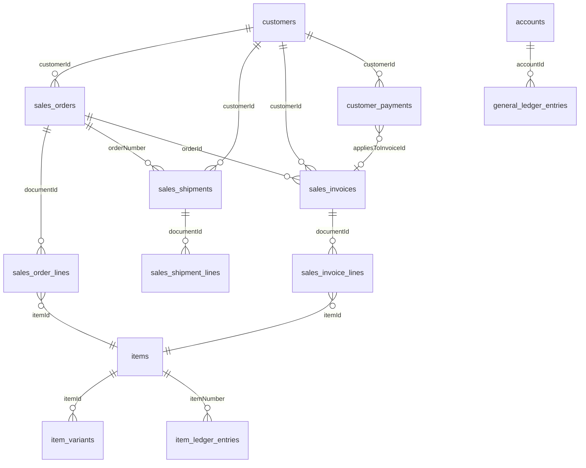
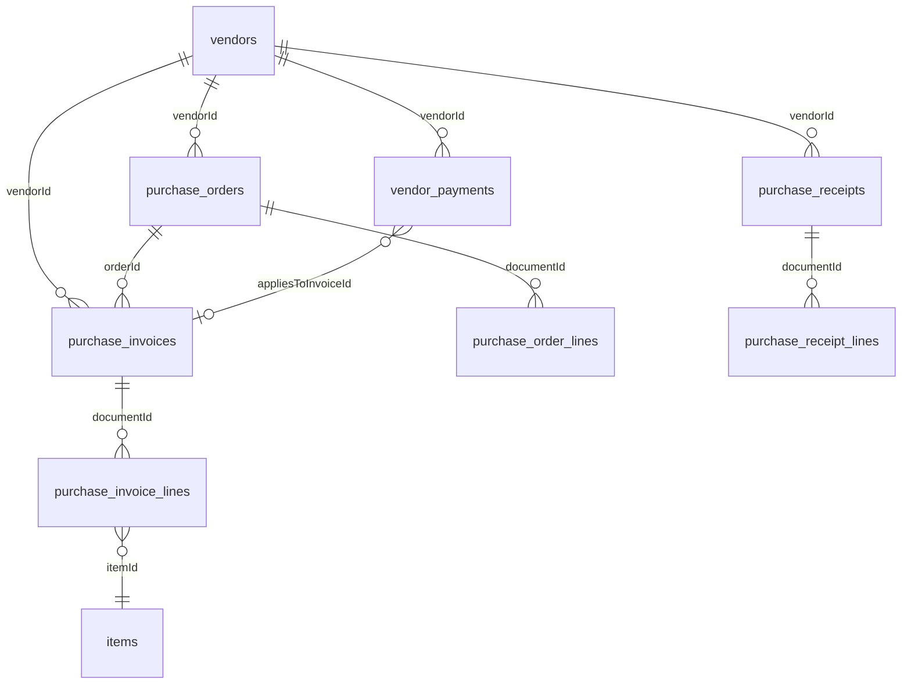

# Dynamics 365 Business Central — Data Model Reference

Reference for **relationships and join paths** across Business Central (BC) entities exposed by the **Microsoft API v2.0 (APV2)** and ingested by HiveFlow as `dbc`.

**Primary source:** [Business Central API v2.0 resources](https://learn.microsoft.com/en-us/dynamics365/business-central/dev-itpro/api-reference/v2.0/resources/dynamics_resources_overview) (Microsoft Learn).

**HiveFlow mapping:** [`packages/hiveflow-connectors/src/hiveflow/bc/entities.py`](../packages/hiveflow-connectors/src/hiveflow/bc/entities.py) · **Setup:** [business-central-setup.md](./business-central-setup.md)

---

## Platform architecture (DBC-first)

HiveFlow deployments centered on Business Central treat **DBC as the system of record** for operational and financial data. BC includes its own general ledger, AR/AP, inventory, and document chains — so there is **no requirement to reconcile DBC against QuickBooks (QBO/QBD)** for a BC-native customer.

| Layer | Role |
|---|---|
| **~90% DBC** | Master data, sales/purchase documents, payments, G/L, item ledger, dimensions |
| **Optional adjuncts** | Excel forecasts, CRM exports, WMS spreadsheets, pricing files — ingested later as supplemental sources |
| **Cross-ERP mesh** | Only when the customer genuinely runs multiple ERPs (e.g. BC + QBO for different divisions) |

**Design implication:** Meshes, dashboards, and exception rules for a BC customer are built **inside the DBC graph** (order → ship → invoice → payment → G/L). External files attach at defined join points (customer number, item number, fiscal period) rather than driving a multi-ERP canonical model.

**Future adjunct example:** A forecast uploaded from Excel joins to `items.number` and fiscal period; variance analysis compares forecast to `sales_invoice_lines` and `general_ledger_entries` — without replacing BC as the accounting source.

---

## Scope

| Concept | Detail |
|---|---|
| **API** | `GET .../v2.0/{tenant}/{environment}/api/v2.0/companies({companyId})/{resource}` |
| **Company scope** | All entities below are per BC company (`BC_COMPANY_ID`) |
| **Bronze** | API-faithful snapshots under `raw/dbc/` (headers include nested line JSON from `$expand`) |
| **Silver_stg** | Consolidated ingest tables under `silver_stg/dbc/` — **document lines split into separate tables** |
| **Silver** | DNA-pack tables under `silver/dbc/` (column adds and gold sources only) |
| **Line data** | Join `sales_order_lines.documentId` → `sales_orders.id` (and equivalents for purchase docs) |

This document describes **logical BC relationships** for joins and intra-DBC analytics — not a cross-ERP canonical model.

---

## Join conventions (APV2)

Microsoft uses a consistent pattern across document entities:

| Pattern | Example | Use for joins |
|---|---|---|
| **Primary key** | `id` (GUID) | Stable row identity within a resource |
| **Business number** | `number`, `customerNumber`, `itemNumber` | Human-readable keys; duplicated on headers for reporting |
| **Foreign key (GUID)** | `customerId`, `itemId`, `documentId` | Preferred join key when both sides expose GUIDs |
| **Foreign key (number)** | `customerNumber`, `orderNumber` | Fallback joins; verify uniqueness within company |
| **Document lineage** | `orderId` / `orderNumber` on posted invoices/shipments | Links fulfillment/billing back to sales/purchase order |
| **Application** | `appliesToInvoiceId` on payments | Links cash receipt to open invoice |
| **Ledger link** | `documentNumber` + `postingDate` on G/L and item ledger | Soft link across subsystems (not always GUID-backed in API) |

**Navigation properties** in Microsoft docs (e.g. `$expand=customer,salesInvoiceLines`) describe the same relationships as the `*Id` fields on the JSON payload.

---

## End-to-end process flows

### Order-to-cash (sales)

Typical BC document chain for distribution / intra-ERP meshes (`MESH-BC-INTRA`):

```text
salesQuote → salesOrder → salesShipment → salesInvoice → customerPayment
                ↓              ↓                ↓
         salesOrderLines  salesShipmentLines  salesInvoiceLines
                ↓                              ↓
              items · locations · unitsOfMeasure · dimensions
                ↓
         itemLedgerEntries (posted inventory movement)
                ↓
         generalLedgerEntries (posted finance)
```



### Procure-to-pay (purchasing)

```text
purchaseOrder → purchaseReceipt → purchaseInvoice → vendorPayment
       ↓               ↓                  ↓
purchaseOrderLines  purchaseReceiptLines  purchaseInvoiceLines
       ↓
     items · vendors · locations
       ↓
itemLedgerEntries · generalLedgerEntries
```



---

## Domain reference

### Master data — parties & catalog

| HiveFlow table | BC resource | Primary key | Related entities (via) |
|---|---|---|---|
| `customers` | `customers` | `id` | `sales_*`, `customer_payments`, `customer_financial_details`, `customer_contacts`, `opportunities` |
| `vendors` | `vendors` | `id` | `purchase_*`, `vendor_payments`, `apply_vendor_entries` |
| `items` | `items` | `id` | All document lines (`itemId`), `item_variants`, `item_categories` |
| `item_variants` | `itemVariants` | `id` | `itemId` → `items.id` |
| `item_categories` | `itemCategories` | `id` | Hierarchy/code on `items` |
| `contacts` | `contacts` | `id` | CRM; may link to customers via separate contact tables |
| `employees` | `employees` | `id` | `time_registration_entries`, approvals |
| `salespeople_purchasers` | `salespeoplePurchasers` | `code` | Referenced on documents as `salesperson` / `purchaser` |

**Customer defaults** (header-level FK pattern repeated on all sales documents):

| FK on documents | Target resource | HiveFlow lookup table |
|---|---|---|
| `customerId` | `customers` | `customers` |
| `currencyId` | `currencies` | `currencies` |
| `paymentTermsId` | `paymentTerms` | `payment_terms` |
| `shipmentMethodId` | `shipmentMethods` | `shipment_methods` |
| `paymentMethodId` | `paymentMethods` | `payment_methods` (customer master only) |

Microsoft navigation on [`customer`](https://learn.microsoft.com/en-us/dynamics365/business-central/dev-itpro/api-reference/v2.0/resources/dynamics_customer): `currency`, `paymentTerm`, `shipmentMethod`, `paymentMethod`, `customerFinancialDetail`, `defaultDimensions`, `agedAccountsReceivable`.

---

### Sales documents

| HiveFlow table | BC resource | Header join keys | Line expand | Silver line table |
|---|---|---|---|---|
| `sales_quotes` | `salesQuotes` | `customerId` | `salesQuoteLines` | `sales_quote_lines` |
| `sales_orders` | `salesOrders` | `customerId` | `salesOrderLines` | `sales_order_lines` |
| `sales_shipments` | `salesShipments` | `customerId`, **`orderNumber`** | `salesShipmentLines` | `sales_shipment_lines` |
| `sales_invoices` | `salesInvoices` | `customerId`, **`orderId`**, **`orderNumber`** | `salesInvoiceLines` | `sales_invoice_lines` |
| `sales_credit_memos` | `salesCreditMemos` | `customerId` | `salesCreditMemoLines` | `sales_credit_memo_lines` |
| `customer_payments` | `customerPayments` | `customerId`, **`appliesToInvoiceId`** | — | — |
| `customer_payment_journals` | `customerPaymentJournals` | — | — | — |
| `open_sales_invoices` | `salesInvoices` (`status eq 'Open'`) | Same as `sales_invoices` | Same | `sales_invoice_lines` (shared) |

**Key sales header fields (Microsoft):**

| Field | Links to | Notes |
|---|---|---|
| `orderId` / `orderNumber` | `sales_orders` | On posted `salesInvoices` and some shipments — read-only lineage |
| `billToCustomerId` | `customers` | Bill-to vs sell-to customer |
| `customerPurchaseOrderReference` | External PO | Common cross-system matching field |
| `status` | Workflow | Draft / Open / Paid on invoices |

**Sales invoice line fields (Microsoft [`salesInvoiceLine`](https://learn.microsoft.com/en-us/dynamics365/business-central/dev-itpro/api-reference/v2.0/resources/dynamics_salesinvoiceline)):**

| Line field | Target |
|---|---|
| `documentId` | Parent `sales_invoices.id` |
| `itemId` | `items.id` |
| `accountId` | `accounts.id` (G/L line type) |
| `unitOfMeasureId` | `units_of_measure.id` |
| `itemVariantId` | `item_variants.id` |
| `locationId` | `locations.id` |

---

### Purchasing documents

Mirror of sales with `vendorId` / `payToVendorId`:

| HiveFlow table | BC resource | Silver line table | Notable lineage fields |
|---|---|---|---|
| `purchase_orders` | `purchaseOrders` | `purchase_order_lines` | `vendorId` |
| `purchase_receipts` | `purchaseReceipts` | `purchase_receipt_lines` | `orderNumber` |
| `purchase_invoices` | `purchaseInvoices` | `purchase_invoice_lines` | `vendorId`, `orderId`, `vendorInvoiceNumber` |
| `purchase_credit_memos` | `purchaseCreditMemos` | `purchase_credit_memo_lines` | Vendor credits |
| `vendor_payments` | `vendorPayments` | — | `vendorId`, applies-to invoice fields |
| `vendor_payment_journals` | `vendorPaymentJournals` | — | Journal batches |
| `apply_vendor_entries` | `applyVendorEntries` | — | Open vendor ledger applications |

---

### Finance & general ledger

| HiveFlow table | BC resource | Join keys | Notes |
|---|---|---|---|
| `accounts` | `accounts` | `id`, `number` | Chart of accounts |
| `general_ledger_entries` | `generalLedgerEntries` | **`accountId`**, `documentNumber`, `postingDate` | Posted G/L; read-only |
| `bank_accounts` | `bankAccounts` | `id`, `number` | Cash management |
| `journals` | `journals` | `id` | Journal templates/batches |
| `journal_lines` | `journalLines` | `journalId`, `accountId` | Unposted journal lines |
| `general_ledger_setup` | `generalLedgerSetup` | Singleton | Company GL settings |
| `accounting_periods` | `accountingPeriods` | `id` | Period open/closed |

**G/L entry (Microsoft [`generalLedgerEntry`](https://learn.microsoft.com/en-us/dynamics365/business-central/dev-itpro/api-reference/v2.0/resources/dynamics_generalledgerentry)):**

| Field | Purpose |
|---|---|
| `accountId` / `accountNumber` | Join to `accounts` |
| `documentNumber` | Join to source sales/purchase document numbers |
| `documentType` | Payment, Invoice, Credit Memo, etc. |
| `debitAmount` / `creditAmount` | Posted amounts |

Financial **report** entities (`balance_sheets`, `income_statements`, `trial_balances`, `aged_accounts_receivables`, etc.) are snapshot aggregates — not normalized FK graphs. Join on report dimensions (account number, date filters) rather than document GUIDs.

---

### Inventory & operations

| HiveFlow table | BC resource | Join keys | Notes |
|---|---|---|---|
| `item_ledger_entries` | `itemLedgerEntries` | **`itemNumber`**, `documentNumber`, `postingDate` | Posted inventory movements; no `itemId` in API |
| `locations` | `locations` | `id`, `code` | Warehouse/location on lines |
| `units_of_measure` | `unitsOfMeasure` | `id`, `code` | UOM on lines |
| `inventory_posting_groups` | `inventoryPostingGroups` | Code | Posting setup |
| `general_product_posting_groups` | `generalProductPostingGroups` | Code | Posting setup |

**Item ledger (Microsoft [`itemLedgerEntry`](https://learn.microsoft.com/en-us/dynamics365/business-central/dev-itpro/api-reference/v2.0/resources/dynamics_itemledgerentry)):**

| Field | Typical join |
|---|---|
| `itemNumber` | → `items.number` |
| `documentNumber` | → sales/purchase posted doc `number` |
| `documentType` | Sales shipment, purchase receipt, etc. |
| `entryType` | Sale, Purchase, Transfer, … |
| `quantity`, `costAmountActual`, `salesAmountActual` | Operational metrics |

---

### Dimensions & analytics

| HiveFlow table | BC resource | Relationships |
|---|---|---|
| `dimensions` | `dimensions` | Dimension definitions (DEPARTMENT, PROJECT, …) |
| `dimension_values` | `dimensionValues` | `dimensionId` → `dimensions.id` |
| `default_dimensions` | `defaultDimensions` | Default dimension per customer/item/account |
| *(on documents)* | `dimensionSetLines` via `$expand` | Shortcut: `shortcutDimension1Code`, `shortcutDimension2Code` on headers/lines |

Dimensions attach to most headers, lines, payments, and ledger entries through **`dimensionSetLines`** navigation in APV2.

---

### CRM, projects, fixed assets, workflow

| HiveFlow table | BC resource | Key relationships |
|---|---|---|
| `opportunities` | `opportunities` | CRM pipeline; contact/customer linkage via BC CRM fields |
| `customer_contacts` | `customerContacts` | `customerId` → `customers` |
| `customer_financial_details` | `customerFinancialDetails` | 1:1 navigation from `customers` |
| `projects` | `projects` | Job/project costing |
| `time_registration_entries` | `timeRegistrationEntries` | `jobId` / project links |
| `fixed_assets` | `fixedAssets` | Asset master |
| `fixed_asset_locations` | `fixedAssetLocations` | Asset locations |
| `workflows` | `workflows` | Approval/workflow definitions |
| `workflow_steps` | `workflowSteps` | `workflowId` |
| `approval_entries` | `approvalEntries` | Document approval queue |
| `posted_approval_entries` | `postedApprovalEntries` | Historical approvals |

---

## HiveFlow entity bundles

| Bundle | Entities | Primary mesh use |
|---|---|---|
| **`v1_intra`** | customers, items, sales_orders, sales_shipments, sales_invoices, customer_payments | Order → ship → invoice → cash |
| **`v1_accounting`** | customers, sales_invoices, open_sales_invoices, customer_payments | AR / billing exceptions |
| **`full`** | All ~75 APV2 entities in [`entities.py`](../packages/hiveflow-connectors/src/hiveflow/bc/entities.py) | Full operational lake |

---

## Recommended join paths (intra-DBC analytics)

### Order-to-cash hero paths

| Business question | Join path |
|---|---|
| Order fulfilled but not invoiced | `sales_orders.number` = `sales_shipments.orderNumber` LEFT JOIN `sales_invoices` ON `orderId` or `orderNumber` |
| Line-level fulfillment gap | `sales_order_lines` → `sales_shipment_lines` / `sales_invoice_lines` via `itemId` + `documentId` chains |
| Invoice open / overdue | `sales_invoices` WHERE `status` = Open; aging from `aged_accounts_receivables` or `dueDate` |
| Payment applied to invoice | `customer_payments.appliesToInvoiceId` = `sales_invoices.id` |
| Line-level margin / COGS | `sales_invoice_lines.itemId` → `items`; cost from `item_ledger_entries` by `documentNumber` |
| Customer master alignment | All `customerId` → `customers.id`; secondary match on `customerNumber` |

### Cross-module (sales → finance)

| From | To | Join |
|---|---|---|
| `sales_invoices.number` | `general_ledger_entries.documentNumber` | Same posting; filter `documentType` = Invoice |
| `sales_invoices.number` | `item_ledger_entries.documentNumber` | Shipment/invoice posting |
| `customer_payments.documentNumber` | `general_ledger_entries.documentNumber` | Payment posting |

---

## APV2 vs BC table IDs (important)

Microsoft documents a known mismatch for **posted invoices**:

> The API `id` on `salesInvoice` / `purchaseInvoice` may differ from the BC table `systemId`. For posted documents, use the [Automate API posted invoice routes](https://learn.microsoft.com/en-us/dynamics365/business-central/dev-itpro/api-reference/v2.0/resources/dynamics_salesinvoice) to map `systemId` ↔ API `id`.

For HiveFlow lake joins, **use fields present in parquet** (`id`, `number`, `orderNumber`, `appliesToInvoiceId`) consistently within the API layer — do not assume API GUIDs match BC UI record IDs.

---

## HiveFlow ingest notes

| Topic | Behavior |
|---|---|
| **Incremental** | `lastModifiedDateTime` watermarks per entity in `raw/dbc/_state/watermarks.json` |
| **Bronze** | `$expand` line collections stored as JSON strings on header rows (API-faithful) |
| **Silver headers** | Line arrays stripped; one row per document |
| **Silver lines** | Exploded into `*_lines` tables (e.g. `sales_invoice_lines`); join on `documentId` → header `id` |
| **Line merge key** | Line `id` (GUID); `header_id` / `header_number` denormalized for convenience |
| **Filtered entities** | `open_sales_invoices` shares `sales_invoice_lines` with `sales_invoices` |
| **Catalog** | Line tables are silver-only (`silver_dbc_sales_order_lines`, etc.) |

Silver unpack: [`packages/hiveflow-lake/src/hiveflow/silver/unpack/dbc_documents.py`](../packages/hiveflow-lake/src/hiveflow/silver/unpack/dbc_documents.py)

---

## Silver line tables

| Header entity | Silver line table | Join |
|---|---|---|
| `sales_quotes` | `sales_quote_lines` | `documentId` → `sales_quotes.id` |
| `sales_orders` | `sales_order_lines` | `documentId` → `sales_orders.id` |
| `sales_shipments` | `sales_shipment_lines` | `documentId` → `sales_shipments.id` |
| `sales_invoices` | `sales_invoice_lines` | `documentId` → `sales_invoices.id` |
| `sales_credit_memos` | `sales_credit_memo_lines` | `documentId` → `sales_credit_memos.id` |
| `purchase_orders` | `purchase_order_lines` | `documentId` → `purchase_orders.id` |
| `purchase_receipts` | `purchase_receipt_lines` | `documentId` → `purchase_receipts.id` |
| `purchase_invoices` | `purchase_invoice_lines` | `documentId` → `purchase_invoices.id` |
| `purchase_credit_memos` | `purchase_credit_memo_lines` | `documentId` → `purchase_credit_memos.id` |

---

## Full entity catalog (HiveFlow `full` bundle)

| Domain | HiveFlow output | BC resource |
|---|---|---|
| **Master** | customers | customers |
| | vendors | vendors |
| | items | items |
| | item_variants | itemVariants |
| | item_categories | itemCategories |
| | contacts | contacts |
| | contact_information | contactsInformation |
| | employees | employees |
| | salespeople_purchasers | salespeoplePurchasers |
| | units_of_measure | unitsOfMeasure |
| | locations | locations |
| | payment_terms | paymentTerms |
| | payment_methods | paymentMethods |
| | shipment_methods | shipmentMethods |
| | countries_regions | countriesRegions |
| | currencies | currencies |
| | currency_exchange_rates | currencyExchangeRates |
| | tax_areas | taxAreas |
| | tax_groups | taxGroups |
| | customer_return_reasons | customerReturnReasons |
| | dispute_status | disputeStatus |
| | inventory_posting_groups | inventoryPostingGroups |
| | general_product_posting_groups | generalProductPostingGroups |
| **Dimensions** | dimensions | dimensions |
| | dimension_values | dimensionValues |
| | default_dimensions | defaultDimensions |
| **Sales** | sales_quotes | salesQuotes |
| | sales_orders | salesOrders |
| | sales_shipments | salesShipments |
| | sales_invoices | salesInvoices |
| | sales_credit_memos | salesCreditMemos |
| | customer_payments | customerPayments |
| | customer_payment_journals | customerPaymentJournals |
| | customer_contacts | customerContacts |
| | customer_financial_details | customerFinancialDetails |
| | opportunities | opportunities |
| **Purchase** | purchase_orders | purchaseOrders |
| | purchase_receipts | purchaseReceipts |
| | purchase_invoices | purchaseInvoices |
| | purchase_credit_memos | purchaseCreditMemos |
| | vendor_payments | vendorPayments |
| | vendor_payment_journals | vendorPaymentJournals |
| | apply_vendor_entries | applyVendorEntries |
| **Finance** | accounts | accounts |
| | bank_accounts | bankAccounts |
| | journals | journals |
| | journal_lines | journalLines |
| | general_ledger_entries | generalLedgerEntries |
| | general_ledger_setup | generalLedgerSetup |
| | accounting_periods | accountingPeriods |
| **Inventory** | item_ledger_entries | itemLedgerEntries |
| **Assets / projects** | fixed_assets | fixedAssets |
| | fixed_asset_locations | fixedAssetLocations |
| | projects | projects |
| | time_registration_entries | timeRegistrationEntries |
| **Reports** | aged_accounts_receivables | agedAccountsReceivables |
| | aged_accounts_payables | agedAccountsPayables |
| | balance_sheets | balanceSheets |
| | income_statements | incomeStatements |
| | cash_flow_statements | cashFlowStatements |
| | trial_balances | trialBalances |
| | retained_earnings_statements | retainedEarningsStatements |
| **System** | company_information | companyInformation |
| | document_attachments | documentAttachments |
| | approval_entries | approvalEntries |
| | approval_user_setups | approvalUserSetups |
| | posted_approval_entries | postedApprovalEntries |
| | workflows | workflows |
| | workflow_steps | workflowSteps |
| | workflow_approvers | workflowApprovers |
| | workflow_response_options | workflowResponseOptions |
| | job_queue_entries | jobQueueEntries |
| | job_queue_log_entries | jobQueueLogEntries |

---

## Microsoft Learn quick links

| Resource | URL |
|---|---|
| API overview | https://learn.microsoft.com/en-us/dynamics365/business-central/dev-itpro/api-reference/v2.0/ |
| customer | https://learn.microsoft.com/en-us/dynamics365/business-central/dev-itpro/api-reference/v2.0/resources/dynamics_customer |
| salesOrder | https://learn.microsoft.com/en-us/dynamics365/business-central/dev-itpro/api-reference/v2.0/resources/dynamics_salesorder |
| salesShipment | https://learn.microsoft.com/en-us/dynamics365/business-central/dev-itpro/api-reference/v2.0/resources/dynamics_salesshipment |
| salesInvoice | https://learn.microsoft.com/en-us/dynamics365/business-central/dev-itpro/api-reference/v2.0/resources/dynamics_salesinvoice |
| salesInvoiceLine | https://learn.microsoft.com/en-us/dynamics365/business-central/dev-itpro/api-reference/v2.0/resources/dynamics_salesinvoiceline |
| customerPayment | https://learn.microsoft.com/en-us/dynamics365/business-central/dev-itpro/api-reference/v2.0/resources/dynamics_customerpayment |
| purchaseInvoice | https://learn.microsoft.com/en-us/dynamics365/business-central/dev-itpro/api-reference/v2.0/resources/dynamics_purchaseinvoice |
| generalLedgerEntry | https://learn.microsoft.com/en-us/dynamics365/business-central/dev-itpro/api-reference/v2.0/resources/dynamics_generalledgerentry |
| itemLedgerEntry | https://learn.microsoft.com/en-us/dynamics365/business-central/dev-itpro/api-reference/v2.0/resources/dynamics_itemledgerentry |

---

## Related HiveFlow docs

- [business-central-setup.md](./business-central-setup.md) — connector setup
- [onboarding/business-central.md](../onboarding/business-central.md) — client onboarding
- Mesh catalog (`MESH-BC-INTRA`) — moved to the sibling business repo, under the pre-rename `mesh-*` name
- [data-lake-architecture.md](./internal-execution-scoping/data-lake-architecture.md) — bronze/silver layout
