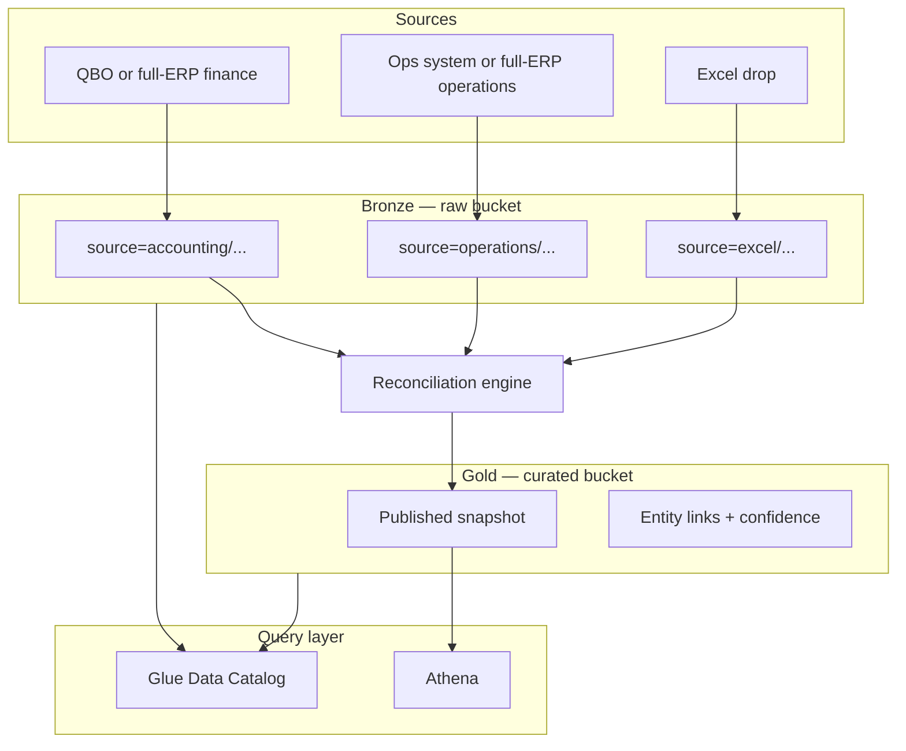

# Data Lake Architecture

How HiveFlow stores, organizes, and queries multi-source ingest data on AWS — from connector landing zones through published snapshots.

**Audience:** Internal product and engineering. Not customer-facing.

**Companion docs:**

- [product-vision.md](../product-vision.md) — north star, layer model, connector tiers
- [reconciliation-engine.md](./reconciliation-engine.md) — parse → map → match → publish pipeline
- [v1-scope.md](./v1-scope.md) — v1 sources and capabilities
- [pre-launch-checklist.md](../business-admin/pre-launch-checklist.md) — infra provisioning checklist

> **Framing note.** The lake design below is **universal core — unchanged and industry-agnostic**. Its ICP examples (split ops + QuickBooks stacks, full-ERP manufacturers) predate the current framing in [product-vision.md](../product-vision.md); read them as illustrative. Industry framework packs land on exactly this layout — a pack changes what `silver/` and `gold/dna/` *mean*, not where they live.
>
> Connector playbooks previously lived in `industry-system-clusters.md`, which now sits in the sibling repo `../../hiveflow-business/`.

---

## Purpose

HiveFlow connects client source systems—or cross-module extracts from a full ERP—into one canonical model. A split-stack tenant may use ops + QuickBooks + Excel; a full-ERP tenant may use only NetSuite or BC modules, with Excel/satellites as optional sources.

The **data lake** is the storage and query layer underneath that pipeline:

- **Bronze (raw)** — immutable, append-only extracts per source
- **Gold (curated)** — published snapshots and link tables after reconciliation
- **Catalog + SQL** — Glue Data Catalog and Athena for internal ops and downstream reads

Ingest Lambdas **only write bronze**. The reconciliation engine **reads bronze and writes gold**. Downstream product reads **gold only**.

---

## High-level flow



**Schedule (typical):** source ingests overnight (staggered), reconciliation runs after all required batches arrive, briefing reads published snapshot in the morning.

---

## Tenant isolation

Each **company × environment** gets dedicated AWS resources. No cross-tenant data commingling.

| Resource | Naming pattern | Notes |
|---|---|---|
| Raw S3 bucket | `raw-{company}-{environment}-{account}-{region}` | Bronze landing zone |
| Curated S3 bucket | `curated-{company}-{environment}-{account}-{region}` | Gold published data |
| Glue database | `hiveflow_{company}_{environment}` | Catalog namespace |
| Secrets Manager | `hiveflow-{company}-{source}-{environment}` | One secret per connector |
| Athena workgroup | `hiveflow-{company}-{environment}` | Optional; query results bucket separate |

Templates live in `config.yaml` under `secrets.*_bucket_name_template`. See [project_config.py](../../packages/hiveflow-platform/src/hiveflow/project_config.py) for resolution helpers.

**Do not** use one shared raw bucket across tenants. **Do not** use one bucket per connector — use **prefix isolation** within the tenant raw bucket instead.

---

## Storage layers

### Bronze — raw bucket

**Role:** Immutable landing zone for every ingest run.

**Properties:**

- Append-only — never overwrite prior runs
- Versioning enabled (S3 bucket versioning)
- SSE-S3 encryption, block public access, enforce SSL
- Lifecycle rules optional (e.g. expire bronze after 90 days once curated is stable)

**Layout:** Hive-style prefixes for Athena/Glue partition projection:

```text
s3://raw-{company}-{env}-{account}-{region}/
  source=qbo/
    ingest_date=2026-07-22/
      run_id=20260722T060000Z/
        entity=customers/part-000.parquet
        entity=invoices/part-000.parquet
        manifest.json

  source=fishbowl/
    ingest_date=2026-07-22/
      run_id=20260722T061500Z/
        entity=sales_orders/part-000.parquet
        entity=shipments/part-000.parquet
        manifest.json

  source=excel/
    inbox/                                    ← client uploads; S3 event trigger
      open_jobs_report.xlsx
    ingest_date=2026-07-22/
      run_id=20260722T064500Z/
        entity=open_jobs/part-000.parquet
        manifest.json
```

**File formats:**

- Entity data: **Parquet** (Snappy compression)
- Run metadata: **JSON** (`manifest.json` per run)

Nested API objects (e.g. QBO `Line`, `MetaData`, `CustomerRef`) are **JSON-encoded strings** in Parquet columns so schemas stay stable across API responses. Reconciliation parses these when line-level fields are needed. Optionally add flattened `{entity}_lines.parquet` files later for hot paths.

### Gold — curated bucket

**Role:** Published, tenant-scoped canonical model after reconciliation.

**Properties:**

- Written only by the reconciliation engine (Stage 9: Publish)
- Downstream Signals and briefing logic read from here
- Provenance bundles stored alongside snapshots for audit/replay

**Layout (illustrative):**

```text
s3://curated-{company}-{env}-{account}-{region}/
  snapshots/
    snapshot_id=2026-07-22T070000Z/
      customers.parquet
      jobs.parquet
      invoices.parquet
      links.parquet
      manifest.json
      provenance.json

  latest/                                     ← pointer or symlink pattern
    snapshot_id=2026-07-22T070000Z/
      ...
```

See [reconciliation-engine.md](./reconciliation-engine.md) for `published_snapshot` schema and publish gates.

### Silver (optional, later)

Parsed and column-mapped staging tables between bronze and gold. **Not required for v1** — reconciliation can read bronze directly. Introduce silver if replay performance or debugging demands materialized mapped tables per source.

---

## Raw batch contract

Every connector — API, file drop, or export — must emit the same **batch contract**. The reconciliation engine depends on this, not on how data was fetched.

```yaml
batch_id: "2026-07-22-0600-acme-fishbowl"
tenant_id: acme
source_system: fishbowl
source_family: fishbowl_qb_excel       # playbook key — see industry-system-clusters.md
extract_type: sales_orders             # named extract in playbook
received_at: 2026-07-22T06:15:00Z
row_count: 1240
file_hash: sha256:...                   # required for file-based sources (Excel)
extract_mode: incremental              # full | incremental
watermark_from: "2026-07-21T06:00:00Z" # API sources; omit for full loads
watermark_to: "2026-07-22T06:15:00Z"
raw_location: s3://raw-acme-dev-.../source=fishbowl/ingest_date=2026-07-22/run_id=.../
schema_version: 1
entities:
  - entity: sales_orders
    format: parquet
    row_count: 1240
    path: s3://raw-acme-dev-.../.../entity=sales_orders/part-000.parquet
  - entity: shipments
    format: parquet
    row_count: 89
    path: s3://...
```

Each run directory includes a top-level `manifest.json` with this payload (plus connector-specific metadata).

**Incremental vs full** is a query and watermark concern, not a separate bucket. Store watermarks in a small state object in S3 (e.g. `raw/dbc/_state/watermarks.json`).

---

## Connectors

Connectors are **independent ingest jobs** that share the batch contract and land in the **same raw bucket** under different `source=` prefixes.

| Source | Trigger | Auth | Incremental strategy | Playbook examples |
|---|---|---|---|---|
| **QuickBooks Online** | EventBridge cron | OAuth2 (Secrets Manager) | QBO query `MetaData.LastUpdatedTime` filter | All QB-path playbooks (universal U1) |
| **Fishbowl** | EventBridge cron | ODBC / export creds | Export timestamp / file hash | Validation-only integration-assurance path |
| **Cin7** | EventBridge cron | API key / OAuth | API `modifiedSince` | Validation-only accounting/commerce assurance path |
| **NetSuite** | EventBridge cron | OAuth2 / token-based | SuiteQL / REST `lastModifiedDate` | `netsuite_intra` (full-ERP Phase 1 candidate) |
| **Dynamics 365 BC** | EventBridge cron | Azure app registration | OData `$filter=lastModifiedDateTime gt ...` | `bc_intra` (full-ERP Phase 1 candidate) |
| **Excel / Sheets** | S3 `PutObject` on `inbox/` | N/A (file drop) | File hash + template version | All playbooks (universal U2) |
| **QuickBooks Desktop** | EventBridge cron | Export credentials | Export timestamp / file hash | Same semantics as QBO |
| **Legacy ERP (CSV/ODBC)** | EventBridge cron or manual drop | ODBC / SFTP | File hash + row count baseline | Job shop playbooks |

### Pull-based (API) connectors

1. Lambda loads credentials from `hiveflow-{company}-{source}-{environment}`
2. Reads watermark for each entity
3. Fetches changed records (or full extract on first run / weekly reconcile)
4. Writes Parquet + `manifest.json` under `source={connector}/ingest_date=.../run_id=.../`
5. Updates watermark on success

**POC reference:** [packages/hiveflow-connectors/src/hiveflow/qbo/ingest.py](../../packages/hiveflow-connectors/src/hiveflow/qbo/ingest.py) — today uses `qbo/{timestamp}/`; migrate to Hive-style paths when adding a second connector.

### Push-based (Excel) connector

1. Client uploads templated file to `source=excel/inbox/`
2. S3 event triggers parse Lambda
3. Validate template version and column headers against playbook
4. Write Parquet + manifest under dated run prefix
5. Move or tag inbox file as processed (avoid reprocessing)

Excel is **push-based**; API connectors are **pull-based**. Both produce identical batch contracts.

---

## Configuration

### Current (single connector)

`config.yaml` today supports one ingest connector per environment:

```yaml
ingest:
  connector: qbo
  schedule:
    hour: 6
    minute: 0
```

CDK deploys one Lambda and derives secret name + S3 prefix from `ingest.connector`.

### Target (multi-source)

Extend to a **sources list** per environment while keeping existing naming templates:

```yaml
secrets:
  secret_name_template: hiveflow-{company}-{source}-{environment}
  raw_bucket_name_template: raw-{company}-{environment}-{account}-{region}
  curated_bucket_name_template: curated-{company}-{environment}-{account}-{region}

companies:
  ACME:
    environments:
      dev:
        aws:
          region: us-east-2
        sources:
          - id: qbo
            connector: qbo
            schedule: { hour: 6, minute: 0 }
          - id: fishbowl
            connector: fishbowl
            schedule: { hour: 6, minute: 15 }
          - id: excel
            connector: excel
            trigger: s3_inbox
            inbox_prefix: source=excel/inbox/
        reconcile:
          schedule: { hour: 7, minute: 0 }
          playbook: fishbowl_qb_excel
          required_sources: [qbo, fishbowl, excel]
```

| Field | Purpose |
|---|---|
| `sources[].connector` | Slug for secret name, S3 prefix, Lambda routing |
| `sources[].schedule` | EventBridge cron for pull connectors |
| `sources[].trigger: s3_inbox` | Event-driven ingest for file drops |
| `reconcile.playbook` | Column maps and entity model — playbooks (`industry-system-clusters.md`) now live in the sibling business repo |
| `reconcile.required_sources` | Batch gate: suppress publish if any required source missing |

---

## AWS services

| Service | Role in HiveFlow lake |
|---|---|
| **S3** | Raw + curated buckets; Excel inbox |
| **Lambda** | Per-connector ingest (one entity per invocation); Excel parse; reconciliation job |
| **Step Functions** | Fan-out scheduled ingest: prepare → Map(entities) → finalize manifest |
| **EventBridge** | Scheduled ingests; reconciliation trigger |
| **Secrets Manager** | Connector credentials + OAuth tokens |
| **Glue Data Catalog** | Table definitions over raw and curated prefixes |
| **Athena** | SQL access for ops, debugging, and downstream analytics |
| **CloudWatch** | Batch failures, row-count anomaly alarms |
| **Step Functions** | Optional — orchestrate "all sources done → reconcile → publish" |

**Not in v1 scope:** EMR, Redshift, Databricks, Kinesis/streaming. Daily batch matches the morning-briefing product cadence.

---

## Glue and Athena

### Glue database

One database per tenant environment: `hiveflow_{company}_{environment}`.

### Tables (examples)

| Table | Location | Use |
|---|---|---|
| `raw_qbo_customers` | `s3://raw-.../source=qbo/.../entity=customers/` | Debug, replay |
| `raw_qbo_invoices` | `s3://raw-.../source=qbo/.../entity=invoices/` | Debug, replay |
| `raw_fishbowl_sales_orders` | `s3://raw-.../source=fishbowl/.../entity=sales_orders/` | Debug, replay |
| `raw_fishbowl_shipments` | `s3://raw-.../source=fishbowl/.../entity=shipments/` | Debug, replay |
| `raw_excel_open_jobs` | `s3://raw-.../source=excel/.../entity=open_jobs/` | Debug, replay |
| `curated_customers` | Latest published snapshot | Product, Signals |
| `curated_jobs` | Latest published snapshot | Product, Signals |
| `curated_invoices` | Latest published snapshot | Product, Signals |
| `curated_links` | Entity resolution output | Product, Signals |

Prefer **explicit table registration** (known Parquet schema) over crawlers for production. Crawlers acceptable for early POC exploration.

### Athena

- Workgroup per tenant with cost controls
- Query results in a small dedicated bucket (e.g. `athena-results-{company}-{environment}-...`)
- Raw tables: internal ops and ingest validation only
- Curated tables: what downstream exception logic queries

---

## Relationship to reconciliation

```text
INGEST (connectors → bronze)  →  RECONCILE (bronze → gold)  →  SIGNALS (gold → briefing)
```

| Stage | Where it runs | Storage |
|---|---|---|
| Ingest | Connector Lambdas | Write raw bucket |
| Parse / Map / Match / … | Reconciliation engine | Read raw; optional silver |
| Publish | Reconciliation engine | Write curated bucket |
| Exception rules | Downstream product | Read curated only |

Ingest failures are isolated per source. Reconciliation applies **degraded mode** when a required batch is missing — see [confidence-and-provenance.md](./confidence-and-provenance.md).

---

## CDK stacks (target)

| Stack | Contents |
|---|---|
| **LakeStack** | Raw bucket, curated bucket, Glue database, Athena workgroup |
| **IngestStack-{source}** | Per-connector Lambda, schedule, secret reference, IAM |
| **ReconcileStack** | Reconciliation Lambda, publish schedule, curated write IAM |

**POC today:** [infra/stacks/ingest_stack.py](../../infra/stacks/ingest_stack.py) deploys raw bucket + connector pipelines. LakeStack and ReconcileStack are not yet implemented.

Evolution path:

1. Extract shared bucket + IAM into LakeStack
2. Generalize IngestStack to accept `connector` parameter
3. Add ReconcileStack when reconciliation code lands

---

## Build order

| Phase | Deliverable |
|---|---|
| **1 — Foundation (done / in progress)** | QBO → raw bucket; manifest per run; Secrets Manager auth |
| **2 — Lake infra** | Curated bucket; Glue database; bucket name templates in config |
| **3 — Multi-source config** | `sources[]` in config.yaml; CDK multi-Lambda deploy |
| **4 — Excel inbox + canonical A+B model** | S3 trigger; order, fulfillment, invoice, payment, and inventory contracts independent of winning source family |
| **5 — Discovery-selected connector** | Build NetSuite or BC; allow Fishbowl/Cin7 only after a measured native-integration gap |
| **6 — Reconciliation job** | Bronze → gold publish; cross-system and cross-module batch gates |
| **7 — Second connector family** | Only after repeatable paid delivery on Phase 1 |
| **8 — Orchestration** | Step Functions fan-out ingest per entity; optional cross-source reconcile orchestration |

---

## Anti-patterns

| Avoid | Why | Instead |
|---|---|---|
| Bucket per connector | Operational overhead; breaks tenant isolation model | Prefix per source in tenant raw bucket |
| Bucket per incremental vs full | Incremental is a write pattern, not a storage tier | Same prefix; watermark in state |
| Shared raw bucket across tenants | Compliance and isolation risk | One raw + one curated bucket per tenant |
| Ingest Lambda writes curated | Skips reconciliation gates | Always bronze → reconcile → gold |
| Real-time streaming (v1) | Product is daily briefing | Scheduled batch |
| Downstream reads raw | Exposes dirty, unlinked data | Curated / published snapshot only |

---

## Current POC mapping

| POC today | Data lake target |
|---|---|
| `raw-{company}-{env}-{account}-{region}` | Same — add curated bucket |
| `qbo/{timestamp}/` prefix | `source=qbo/ingest_date=.../run_id=.../` |
| Single QBO Lambda | One Lambda per connector (or routed handler) |
| `ingest.connector: qbo` | `sources[]` list |
| Parquet entity files + manifest | Same — standardize manifest schema |
| No Glue / Athena | Glue DB + table registration |
| No reconciliation storage | Curated bucket + published snapshots |

---

## Related infrastructure checklist

From [pre-launch-checklist.md](../business-admin/pre-launch-checklist.md):

- S3 (raw + curated per tenant)
- AWS Glue Data Catalog
- Athena
- Lambda / EventBridge (ingest + refresh)
- Secrets Manager
- CloudWatch
- Tenant isolation — dedicated buckets and secret paths per client
