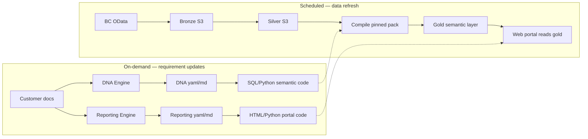

# DNA Semantic Engine

Technical specification for **DNA — Semantic Engine** and the parallel **Reporting Engine**: customer documentation → versioned YAML/MD packs → AI-generated semantic and UI code → certified gold outputs and HiveFlowAI portal.

DNA and Reporting sit inside **DMaaS (Data Model as a Service)** — how the model is delivered: a cloud service that exposes a fully built, governed, continuously updated semantic data model (dimensions, facts, relationships, metrics) through APIs so applications, BI tools, and AI agents can consume structured meaning without building the model themselves. See [architecture.md](../architecture.md#product-framing--dmaas).

**Why this doc matters to the roadmap:** the pack → compile → validate → publish mechanism described here is the machinery that **industry framework packs** will be built on. Packs today are generic accounting; the target is one pack per industry, shipped and reused across every customer in it. See [product-vision.md](../product-vision.md).

**Audience:** Internal product and engineering.

**Companion docs:**

- [product-vision.md](../product-vision.md) — north star, layer model, what an industry framework pack must define
- [architecture.md](../architecture.md) — platform architecture and DMaaS framing
- [dbc-data-model.md](../dbc-data-model.md) — BC join reference
- [ai-boundaries.md](./ai-boundaries.md) — AI guardrails
- [confidence-and-provenance.md](./confidence-and-provenance.md) — provenance model

---

## Architecture overview

### General data flow (steady state)

```text
[data lake (S3 bronze/silver)] → [semantic layer (S3 gold / catalog)] → [web portal (HTML)]
```

Scheduled ingest refreshes **data only**. The semantic layer and portal **layout code** stay pinned until the customer submits a documentation update.

### Customer operations (DBC / DNA)

1. **Ingest** — Pull BC environment into the tenant data lake (bronze → silver).
2. **DNA requirements** — Work with the customer to capture business logic and KPI definitions in a version-controlled **DNA file** (YAML or MD). This is the company's semantic contract; changes are promoted deliberately.
3. **Reporting requirements** — Same pattern for portal layout: charts, tables, filters, dimensions, and page structure in a version-controlled **reporting file** (YAML or MD).
4. **Self-service updates** — Customers submit documentation when they want new KPIs or reports. Provider supports when needed; routine changes do not require professional services.

### Two parallel engines (on-demand only)

DNA and Reporting are **sibling workflows**. They run only when requirements change — **not** as part of the scheduled data refresh.

```text
DNA Engine:
  [customer raw docs] → [AI: consolidate & summarize] → [DNA file yaml/md]
    → [AI: code generator (SQL/Python)] → [updated semantic layer logic]

Reporting Engine:
  [customer raw docs] → [AI: consolidate & summarize] → [reporting file yaml/md]
    → [AI: code generator (HTML/Python)] → [updated portal UI logic]
```

After either engine completes, the existing **compile → validate → publish** path materializes gold tables (DNA) or deploys portal artifacts (Reporting). Scheduled refresh then re-runs **pinned** semantic compile against fresh silver data without re-invoking the AI agents.



---

## Purpose

DNA sits **after ingest silver_stg consolidate** and **before downstream deliverables** (web views, exports, optional BYO-BI). It turns lake data into **customer-approved, version-pinned semantic outputs**.

**Layer line (KPI Generator):**

- **Silver** — DNA-owned **column additions** on existing entities (`governance/.../sql/silver/*.sql`), applied by the DNA Glue job from `silver_stg_*` into `silver/`.
- **Gold** — **new fact/dim/cube tables and KPIs** (`governance/.../sql/gold/*.sql`), applied on the same DNA Glue job after silver.

AI (KPI Generator) may draft SQL only in the portal. Operators **save DNA drafts** for review, then **approve** to pin production; scheduled refreshes **replay approved SQL verbatim** (checksum verified; no Bedrock on refresh). See [kpi-generator.md](../kpi-generator.md). Legacy Python `compile.py` remains for packs without a gold SQL manifest.

Customization depth is bounded by **what the customer can document**, not by a per-KPI services cap. The DNA file + approved SQL pack are the source of truth; humans promote versions before production.

Signals tier customers may skip DNA entirely. DNA customers get governed semantics — not ad-hoc report SQL.

---

## Pipeline position

```text
bronze ingest → silver consolidate → [DNA Engine on update] → compile → validate → publish → web / export
                                    [Reporting Engine on update] → portal codegen → deploy
```

| Stage | When | Process key | Writes |
|---|---|---|---|
| Compile | Scheduled + after DNA pack promotion | `dna_compile` | Staging gold Parquet under `gold/dna/_staging/` |
| Validate | After compile | `dna_validate` | Test results JSON; blocks publish on failure |
| Publish | After validate | `dna_publish` | Production gold under `gold/dna/{output_id}/` + manifest |
| Portal codegen | After reporting pack promotion | Reporting Engine (TBD) | Portal routes, layouts, bindings to gold outputs |

Company DNA config lives under the tenant **governance** prefix (or local `data/` mirror) as `{company}_dna_config`:

```text
governance/{company}_dna_config/workflow.json
governance/{company}_dna_config/v{semver}/{company}_dna_config.yaml
governance/{company}_dna_config/v{semver}/{company}_reporting_config.yaml
governance/{company}_dna_config/v{semver}/sql/manifest.yaml
governance/{company}_dna_config/v{semver}/sql/silver/*.sql
governance/{company}_dna_config/v{semver}/sql/gold/*.sql
governance/{company}_dna_config/v{semver}/manifest.json
```

**Portal:** **KPI Generator** (`/portal/dna/kpi-generator`) — generate Athena SQL, manual gold refresh, save DNA drafts, review and approve/reject ([workflow doc](../kpi-generator.md)).

Gold compile always loads this company DNA config (via `load_production_pack`) to build the semantic layer. The portal layout contract is the co-versioned `{company}_reporting_config.yaml` (via `load_production_reporting`) — same workflow pin / `active_version` as DNA. Portal nav and report pages are driven from that file’s `pages[]` (paths, titles, table/chart `source_output` bindings). In-repo templates remain `dbc_dna_boilerplate.yaml` and `dbc_reporting_boilerplate.yaml`; they are renamed to the company config ids on client init. Legacy `dna.json` / `reporting.json` keys are still readable when present.

**Client init:** Deploying **DnaStack** seeds `{company}_dna_config` + `{company}_reporting_config` when the DNA pack is missing. Deploying **ReportingStack** invokes `ensure_reporting_config` via a CloudFormation custom resource — seeds the reporting sidecar from `dbc_reporting_boilerplate.yaml` when it is missing (even if DNA already exists). DNA publish / CLI `hiveflow-dna init-client` still ensure full governance. Both packs are viewed and updated on the client portal **Governance** page.

**Governance section (client portal):**
- **Pack Registry** `/portal/governance` — DNA/reporting packs and version history
- **Users** `/portal/governance/users` (admin) — list users/roles, invite, change `custom:portal_role`

---

## Definition pack schema

JSON Schema: [`packages/hiveflow-dna/src/hiveflow/dna/schema/definition-pack.schema.json`](../../packages/hiveflow-dna/src/hiveflow/dna/schema/definition-pack.schema.json)

Boilerplate template: [`packages/hiveflow-dna/src/hiveflow/dna/packs/dbc_dna_boilerplate.yaml`](../../packages/hiveflow-dna/src/hiveflow/dna/packs/dbc_dna_boilerplate.yaml) (seeded as `{company}_dna_config.yaml`). Reference example: [`bc_intra_v1.yaml`](../../packages/hiveflow-dna/src/hiveflow/dna/packs/bc_intra_v1.yaml).

### Required sections

| Section | Role |
|---|---|
| `entities` | Grain + silver source table + primary key |
| `joins` | Join paths with cardinality |
| `outputs` | Materialized tables or KPI snapshots to publish |
| `kpis` | Metric definitions (formula type, source output, value column) |
| `tests` | Logic regression tests (not dollar reconciliation) |
| `approval` | Workflow status + approver record |

### Versioning rules

- **Any logic change** (join, filter, formula, grain) → bump `version` semver
- Production refresh pins to the **approved production pack version** — never silently drift
- `changelog[]` records human-readable diffs per version

### Workflow statuses

| Status | Meaning |
|---|---|
| `draft` | AI or internal draft — not publishable |
| `validated` | Human approved semantics — publishable to staging |
| `production` | Customer-signed (or starter pack) — used by scheduled publish |

Promotion: `draft` → `validated` → `production` via [`workflow.py`](../../packages/hiveflow-dna/src/hiveflow/dna/workflow.py).

---

## Compiler

Module: [`packages/hiveflow-dna/src/hiveflow/dna/compile.py`](../../packages/hiveflow-dna/src/hiveflow/dna/compile.py)

Reads silver Parquet (local or S3) and definition pack; writes staging gold tables.

### Build types (v1)

| Build | Behavior |
|---|---|
| `entity_copy` | Subset of columns from silver entity |
| `join` | Left-join per pack join spec; suffix right columns on collision |
| `kpi_aggregate` | Compute KPI snapshot rows from compiled fact tables |

### Output naming

| Artifact | S3 path | Glue table |
|---|---|---|
| Materialized table | `gold/dna/{output_id}/data.parquet` | `dna_{output_id}` |
| KPI snapshot | `gold/dna/kpi_snapshot/data.parquet` | `dna_kpi_snapshot` |

Glue naming uses `dna_catalog_table_name()` in [`project_config.py`](../../packages/hiveflow-platform/src/hiveflow/project_config.py) — no source prefix (gold is cross-entity).

---

## Validator

Module: [`packages/hiveflow-dna/src/hiveflow/dna/validate.py`](../../packages/hiveflow-dna/src/hiveflow/dna/validate.py)

Runs pack `tests[]` against staging outputs. **Does not assert dollar totals.**

| Test type | Asserts |
|---|---|
| `join_orphan_rate` | Orphan left rows ≤ threshold |
| `required_columns` | Output contains named columns |
| `row_count_minimum` | Output row count ≥ minimum |
| `header_line_sum_tolerance` | Reserved for future header/line reconciliation |

Failed validation → publish blocked; alert internal ops (same principle as batch confidence gates).

---

## Publisher

Module: [`packages/hiveflow-dna/src/hiveflow/dna/publish.py`](../../packages/hiveflow-dna/src/hiveflow/dna/publish.py)

On success:

1. Copy staging → `gold/dna/{output_id}/`
2. Write `gold/dna/manifest.json` with pack version, compiler hash, test results, timestamp
3. Sync Glue tables via [`catalog/glue_schema.py`](../../packages/hiveflow-lake/src/hiveflow/catalog/glue_schema.py) `sync_dna_catalog()`

---

## Doc ingestion (DNA Engine — AI-assisted)

Module: **not implemented.** This section describes intended behavior; there is no `ingest_docs` module in `hiveflow-dna` today. The shipped doc pipeline is the BC MS Learn scrape under [`dna/source_docs/`](../../packages/hiveflow-dna/src/hiveflow/dna/source_docs/), which is a different thing — see [bc-source-documentation-lambdas.md](../bc-source-documentation-lambdas.md).

**Trigger:** Customer submits raw documentation (markdown, text, PDF extracts, workshop notes) when they want semantic changes — not on schedule.

Pipeline:

1. **Consolidate & summarize** — AI agent ingests raw docs and proposes or updates the formatted **DNA file** (YAML/MD).
2. **Human review** — Customer or provider promotes draft → validated → production (see workflow statuses).
3. **Code generation** — AI agent generates SQL/Python semantic layer logic from the approved DNA file.
4. **Compile / validate / publish** — Deterministic compiler runs against silver; regression tests gate production.

v1 may use rule-based merge before full LLM codegen; the target architecture is fully agent-driven from customer docs.

---

## Reporting Engine (parallel — AI-assisted)

**Trigger:** Customer submits reporting requirements when they want new or changed portal pages — not on schedule.

Pipeline:

1. **Consolidate & summarize** — AI agent produces or updates the **reporting file** (YAML/MD): charts, graphs, table columns, filters, dimensions, page layout.
2. **Human review** — Same version-control and promotion model as DNA; layout changes are explicit, not silent drift.
3. **Code generation** — AI agent generates HTML/Python (or template) portal code bound to certified gold outputs.
4. **Deploy** — Updated portal artifacts served by UiStack; **no change to underlying KPI calculations** unless DNA pack also changed.

Reporting Engine and DNA Engine are independent: a customer can add a chart (reporting-only) or a new KPI (DNA-only) without touching the other layer.

**Implementation status:** Reporting Engine codegen is planned; v1 UiStack uses hand-authored portal pages reading `gold/dna/*`.

---

## Provenance extension

Every KPI surfaced in the web UI includes:

```yaml
definition_id: KPI-REV-01
definition_version: "1.0.0"
pack_id: bc_intra_v1
source_output: out_fact_revenue_lines
published_at: "2026-07-30T06:00:00Z"
```

---

## Process registry

Registered in [`process_config.yaml`](../../process_config.yaml):

| Key | Stage | Slug |
|---|---|---|
| `dna_compile` | gold | dna-compile |
| `dna_validate` | gold | dna-validate |
| `dna_publish` | gold | dna-publish |
| `dna_refresh` | gold | dna-refresh |

CLI: `hiveflow-dna compile|validate|publish|promote|init-client`

---

## CDK deployment (independent stack)

DNA deploys as **`DnaStack-{company}-{environment}`** — separate from `IngestStack`. Enable in `config.yaml`:

```yaml
dna:
  enabled: true
  source: dbc
  pack_id: bc_intra_v1
  schedule:
    hour: 7    # re-materialize pinned pack against fresh silver (no AI)
    minute: 0
```

The **schedule** re-runs **publish** for the **production-pinned** DNA pack (Athena SQL replay when present, else compile → validate → publish) against updated silver data. It does **not** run doc ingestion, semantic-init, or AI codegen.

```powershell
cd infra
cdk deploy IngestStack-POC-dev   # bronze + silver + catalog
cdk deploy DnaStack-POC-dev      # DNA semantic layer (transforms, gold publish)
cdk deploy GlobalUiStack-dev     # Global HiveFlowAI site + portal auth
cdk deploy ReportingStack-poc-dev   # Per-client reporting UI (charts, KPIs)
```

The DNA stack imports the existing data bucket by name; ingest must be deployed first.
The UI stack serves read-only views from `gold/dna/*` via API Gateway + Lambda (`hiveflow.dna.web`). Branded as **HiveFlowAI** — dark dashboard UI with governed KPI and definition views.

**UiStack outputs:** `ReportingWebUrl` — open in a browser after deploy (POC has no auth gate).

```yaml
ui:
  enabled: true
  pack_id: bc_intra_v1   # optional; defaults to dna.pack_id
```

**v1 pages:** Public site (`/`, `/platform`, `/pricing`) plus authenticated client portal (`/portal/*`) with username/password login and per-client branding from `config.yaml`.

Portal auth: **Amazon Cognito** user pool created by `UiStack`. Provision users with `hiveflow-dna portal-user invite` (email temp password) or `portal-user create` (permanent password). Invited users set a new password on first sign-in at `/portal/login`.

Custom domain (`hive-flow-ai.com`): configured under `ui.domain` in `config.yaml`; CDK provisions Route 53 + ACM + API Gateway mappings. See [hive-flow-ai-domain.md](../onboarding/hive-flow-ai-domain.md) for Squarespace nameserver delegation.

---

## Relationship to reconciliation engine

| Layer | Scope |
|---|---|
| **DNA (v1)** | Intra-ERP / single-source semantic model (BC starter) |
| **Reconciliation engine** | Cross-system entity resolution + exception links |

Signals may eventually read DNA gold tables as inputs instead of re-implementing joins.

---

## Build order

1. Definition pack schema + starter pack (DNA file format)
2. Compile / validate / publish (local + S3) — scheduled against pinned pack
3. Glue catalog sync for `dna_*` tables
4. DNA Engine: doc ingestion → DNA file → semantic codegen + workflow promotion
5. Reporting Engine: doc ingestion → reporting file → portal codegen (TBD)
6. Web UI on gold outputs (HiveFlowAI)
7. Independent **DnaStack** schedule for data refresh only (not AI engines)
