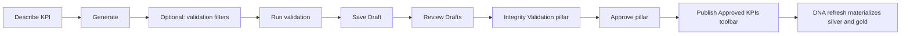

# KPI Generator (DNA Engine)

Natural-language KPI drafting, served as a page inside [DNA Engine](./dna-engine.md) (its own subdomain/app — not the portal shell). The generator is a DNA modeling chat: it reuses existing silver/gold when the client already has the data, asks clarifying questions when the request is under-specified, and only then drafts silver and/or gold Athena SQL. **Approved SQL is pinned under governance semver and replayed verbatim** on scheduled refreshes — AI is not invoked again after approval.

**Route:** `/dna/kpi-generator` on the DNA Engine host (admin only) — see [dna-engine.md](./dna-engine.md) for the site URL and auth model.

**Code (business logic, unchanged/reused):** `packages/hiveflow-portal/src/hiveflow/dna/web/portal/kpi_generator/`

**Code (routing seam):** `packages/hiveflow-portal/src/hiveflow/dna_engine/web/routes.py::register_kpi_generator_routes`

---

## Portal tabs

| Tab | Purpose |
|---|---|
| **KPI Generator** | Describe a KPI, run session validation filters, save as a DNA draft |
| **Review Drafts (N)** | Kanban workflow: integrity validation → approve → publish |

The Review Drafts tab shows a count of proposals in the workflow (`pending_review` or `approved`, not yet published).

---

## Operator workflow



### 1. Generate

On the **KPI Generator** tab, send a natural-language request. Bedrock returns JSON with an `intent`:

| Intent | What happens |
|---|---|
| **clarify** | Assistant asks questions in chat. No SQL, no Save Draft. |
| **reuse** | Existing DNA already answers it. Optional preview SQL against `dna_*` / `silver_*`. No new governance transform. |
| **implement** | One or two drafts: silver column-add (`FROM silver_stg_*`) and/or gold fact/KPI (`FROM silver_*`). Save Draft is enabled. |

Split implement (silver + gold) is used when the request needs a **reusable entity attribute** that is not already in DNA silver **and** a new aggregate table. Gold SQL uses the new column rather than re-inlining a membership list.

The proposal is stored as a **working** session artifact (not yet a governance version). Clarify and reuse turns stay on the same working chat until you implement or discard.

### 2. Validate (optional)

Use **Validation criteria** to add session-only filters (fact, field, value). **Run validation** executes the SQL in Athena with those predicates wrapped around the query. Validation does **not** change the pinned SQL; it is for spot-checking one invoice, customer, etc.

Filters apply only to the validation run unless the same logic is included in the generated SQL itself.

### 3. Save Draft

**Save Draft** is available only on **implement** turns. On the proposed calculation card it:

- Bumps a new **patch** governance version from the current production pin
- Writes DNA pack at that version with `status: draft`
- Writes SQL pack manifest + exact `.sql` files under that version
- Copies reporting sidecar forward at the same version (when present)
- Appends workflow history (does **not** change `active_version`)
- Moves the proposal to `pending_review` and stores a full `governance_snapshot` (prompt, draft, validation, SQL, chat history)
- Clears the KPI Generator compose session so the next KPI starts from a blank chat

**Discard Draft** abandons the working session without writing a governance version and also resets the generator compose UI.

Production portal and scheduled jobs continue to use the **previous** pinned version until a draft is approved.

### 4. Review Drafts (kanban)

Open **Review Drafts**. The board has two pillars; each KPI is its own tile:

| Pillar | Action |
|---|---|
| **Integrity Validation** | Run integrity checks per KPI tile |
| **Approve** | Approve individual KPIs after integrity passes |

Use the toolbar at the top to set the next governance version (patch / minor / major) and click **Publish Approved KPIs** (beside the version field) to materialize all approved KPIs with one DNA refresh.

Approved KPIs appear as a vertical **Ready to publish** list on the right of the toolbar until published. Click a chip to review details; use **×** to remove it from the publish queue (marks the proposal rejected; production pins are unchanged).

Approving one KPI merges that KPI plus any **already approved** contributions for the same silver entity into the current production SQL pack. Other pending drafts for the same table are not promoted until they are approved. **Publish** rebuilds the canonical `enhance__{entity}` transform from every approved contribution for that table (the total enhancement) before starting refresh.

### 5. Approve

**Approve** on a tile that passed integrity validation:

- Merges only that KPI's SQL into a new production governance version (version from the toolbar)
- Pins `workflow.active_version`
- Moves the KPI to the toolbar **Publish Approved KPIs** queue

### 6. Publish

**Publish Approved KPIs** in the Review Drafts toolbar:

- Rebuilds one **total** silver enhancement per affected entity (`enhance__{entity}`) from production contributions plus every approved KPI for that table
- Pins that merged SQL when it differs from the current canonical transform
- Starts one DNA refresh (copy pack-referenced `silver_stg` entities into `silver`, replay silver SQL, then gold)
- Marks all approved KPIs as `published`

The Ready to publish list groups KPIs by table and shows the merged entity enhancement for silver groups.

### 7. Reject

**Reject** marks the proposal `rejected`. Production pins are unchanged. The draft version remains in governance history as a draft; it is not promoted.

---

## Proposal statuses

| Status | Meaning |
|---|---|
| `working` | Generated on the KPI Generator tab; not saved to governance |
| `pending_review` | Saved as a DNA draft; in Integrity Validation or Approve column |
| `approved` | Pinned to production; listed in toolbar until published |
| `published` | Refresh started; removed from Review Drafts |
| `rejected` | Rejected from Review Drafts; not pinned |

---

## Layer rules (SQL packs)

| Change | Layer | SQL path | Runs when |
|---|---|---|---|
| Column adds on an existing silver entity | `silver` | `sql/silver/enhance__{entity}.sql`, mode `add_columns` | DNA refresh (reads `silver_stg_*`, writes `silver/`) |
| New fact table or KPI output | `gold` | `sql/gold/*.sql`, mode `fact_table` or `kpi` | DNA refresh (reads DNA `silver_*`) |

### Silver: one enhancement per entity

Each KPI keeps its own **contribution SQL** under `sql/silver/contributions/{entity}/{kpi_id}.sql`. On Save Draft / Approve, contributions for an entity are merged into exactly **one** canonical transform (`enhance__{entity}` → `sql/silver/enhance__{entity}.sql`). Runtime replays only the canonical transform.

When several approved KPIs add columns to the same silver table, **Publish** rebuilds that canonical transform from the full contribution set (existing production files plus every approved KPI for the entity) so the enhancement that runs is the total of all updates, not the last KPI alone.

Silver contributions must preserve entity grain (no `GROUP BY`, no `SELECT DISTINCT`, no top-level aggregates). Grain-changing logic belongs in the gold layer.

### Split silver + gold

One implement proposal may include both layers. Save Draft writes both SQL files into the same governance version. Session validation and gold integrity inline the silver contribution (which reads `silver_stg_*`) as a CTE so Athena can execute gold SQL against DNA `silver_*` before the DNA Glue job materializes the new column. Pinned gold SQL is unchanged; the rewrite is validation-only.

### Pre-approval integrity validation

Review Drafts groups pending KPIs by affected table (silver entity or gold output). Before approval:

1. **Run integrity validation** merges all contributions for the group and checks row count + primary-key checksum against the **raw silver_stg baseline** captured at consolidate time (`silver_stg/{source}/{entity}/_baseline_fingerprint.json`).
2. On failure, the merge repair LLM receives the mismatch and attempts a corrected query.
3. **Approve group** pins production only after integrity passes (silver) or Athena execution succeeds (gold).

This gate validates base-table integrity only — not KPI business correctness.

### Gold: unique grains

Each gold transform declares `grain_columns` in the manifest (sorted dimension keys; `[]` = company total). The pack rejects duplicate `grain_columns` across gold outputs.

Athena SQL should reference Glue table names **without** a database prefix. Silver column adds query `silver_stg_{source}_{entity}` (ingest). Gold facts/KPIs query DNA-enhanced `silver_{source}_{entity}` and `dna_{output_id}`. The portal normalizes common `silver_stg.` / `silver.` / `gold.` qualifiers before validation.

See also [architecture.md](./architecture.md) (lake layout and layer contract).

---

## Artifacts

**Working / review proposals** (full generator context):

```text
governance/{company}_dna_config/kpi_generator/proposals/{proposal_id}.json
```

**Governance version** (on Save Draft or Approve):

```text
governance/{company}_dna_config/v{semver}/{company}_dna_config.yaml
governance/{company}_dna_config/v{semver}/sql/manifest.yaml
governance/{company}_dna_config/v{semver}/sql/silver/enhance__{entity}.sql
governance/{company}_dna_config/v{semver}/sql/silver/contributions/{entity}/{kpi_id}.sql
governance/{company}_dna_config/v{semver}/sql/gold/*.sql
governance/{company}_dna_config/workflow.json
```

Proposal JSON retains `intent`, `questions` / `reuse` / `drafts`, prompt, primary `draft`, `last_validation`, `governance_version`, and `governance_snapshot` after save.

---

## Related portal surfaces

| Surface | Role |
|---|---|
| **Source Browser** | Gold YAML reference (`entity_properties`, relationships, tags) reconciled with `latest_profile.yaml` from silver ETL |
| **Pack Registry** (`/governance` on the DNA Engine host) | Version history for all governance saves, including KPI Generator drafts and approvals |

Silver consolidate writes `governance/source_semantic_reference/{source}/latest_profile.yaml`; the source-docs gold job enriches all three gold artifacts with `silver_column`, `in_silver`, and `origin` (relationships also get `silver_FK` / `silver_PK`).

---

## Manual DNA refresh

Admins can trigger a DNA Step Functions refresh from the **DNA refresh** card on the KPI Generator page. One job copies pack-referenced ingest `silver_stg` entities into DNA `silver`, replays pinned silver SQL, then gold (Athena SQL pack, else Python compile fallback). Monthly quota is tracked per client (`dna_manual_refresh` in portal config).

---

## Implementation notes

- **Silver_stg catalog:** generate uses `latest_profile.yaml` plus ingest parquet as the authoritative Glue column list (`silver_stg_{source}_{entity}`). Gold SQL uses the same columns on `silver_{source}_{entity}`. Source-docs property names that are not in silver_stg (navigation fields such as `paymentTermsCode`) are not valid SQL.
- **Bedrock budget** shares the portal Config Assist monthly allowance meter.
- **Validation** uses DNA Engine's own Lambda role (Athena + Glue read on the tenant catalog, assumed per-tenant — see [dna-engine.md](./dna-engine.md)).
- **Approve** reuses the same persistence path as the former direct "pin SQL" action, but only after explicit review of a saved draft (or approve from Review Drafts for a `pending_review` proposal at its draft version).
- **Async generation self-invoke**: `enqueue_kpi_generation` (`kpi_generator/generation.py`) self-invokes the currently-running Lambda via `AWS_LAMBDA_FUNCTION_NAME` — since this now runs inside DNA Engine's own Lambda (`dna-engine-{env}-serve`, not the portal shell's), no explicit target-function wiring was needed when this moved; `hiveflow.dna_engine.web.lambda_handler.handler` receives the `kpi_generator_generate` task the same way the shell's handler used to.
