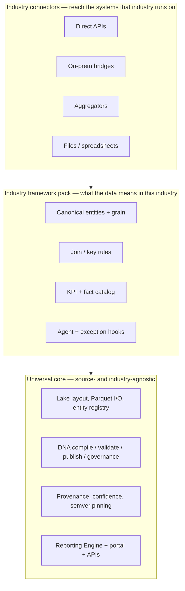

# Product Vision — Centralized Data Model, Industry-Framed

Where HiveFlowAI is going and why the codebase is shaped the way it is. Read this before making roadmap-shaped decisions (new connector, new pack, new engine surface).

**Audience:** Internal product and engineering. Not customer-facing.

**Status:** Direction of travel. This doc records the target; [architecture.md](./architecture.md) records what is actually deployed. Where the two disagree, architecture.md is the truth about today.

---

## North star

> **One centralized, governed data model spanning every system a business runs on — consumed by reporting and by AI agents that optimize operations.**

The model is the product. Connectors are how it gets fed. Reporting and agents are what it feeds. Everything in this repo is in service of the middle layer.

Two consumers, one model:

| Consumer | Needs from the model |
|---|---|
| **Reporting** | Certified metrics, stable grain, drill paths, provenance a controller will defend |
| **AI agents** | Semantics (what a thing *means*), relationships, governance boundaries, and enough trust to act on |

An agent cannot optimize operations against raw tables. It needs to know that `Cust_Nm` and `CustomerName` are the same customer, that this fact is at invoice-line grain, that this KPI is approved and this one is a draft, and where the number came from. That is the model's job.

---

## Why the model is the layer worth owning

| Layer | Who already does it | Why it isn't the moat |
|---|---|---|
| Pipes (move rows A to B) | iPaaS, Fivetran, connector vendors | Commodity, race to zero, no meaning carried |
| Charts (render numbers) | Power BI, Tableau, Looker | Assumes a model already exists |
| **Meaning (governed semantic model)** | **Mostly nobody — per-customer consultants** | **Built once per industry, amortized across every customer in it** |

The expensive, repeated, never-finished work at an SMB is not extraction and it is not visualization — it is deciding what the data *means* and keeping that decision true as the business changes. That work is currently redone from scratch at every customer by a consultant. Doing it once per **industry** and shipping it as a framework is the leverage.

---

## The three layers

| Layer | What it is | State in this repo today |
|---|---|---|
| **Universal core** | Source- and industry-agnostic machinery: lake layout, semantic compile/validate/publish, governance semver, provenance, reporting surfaces | **Shipping.** This is most of `packages/` |
| **Industry framework pack** | The canonical entities, grain contracts, join rules, KPI catalog, and agent hooks for one industry | **Barely started.** Packs exist as a mechanism (`hiveflow-dna` definition packs, `bc_intra_v1`), but no pack is yet a true *industry* framework — current packs are generic accounting |
| **Industry connectors** | Adapters for the systems an industry actually runs on | **Horizontal only.** QBO, QBD, and BC are finance/ERP systems that cut across industries — a foundation, not a vertical |

**The gap that defines the roadmap:** the universal core is real, the vertical layers are not. QBD/QBO/BC gave us a working core and one proven industry-agnostic slice. They were never the destination.

---

## Connector tiers

Not all connectors cost the same or buy the same reach. This distinction drives vertical prioritization more than anything else.

| Tier | Definition | Example | Reach per unit of build |
|---|---|---|---|
| **T1 — Direct** | First-party API, we own and maintain the adapter | QBO (OAuth2), BC (OData) | 1 system |
| **T2 — Bridge** | Customer-side agent or on-prem hop we operate | QBD via Web Connector / SOAP | 1 system, higher ops cost |
| **T3 — Aggregator** | One adapter to a vendor that has already normalized N systems | CRMBridge.ai — 35+ dental PMS + imaging platforms | **N systems** |
| **T4 — File** | Structured upload, governed into the model | Spreadsheet Engine (`.xlsx` into `silver/reference/`) | Long tail, per-customer |

**T3 inverts the economics.** A vertical served by direct connectors costs one integration *per system* — a dental strategy built on T1 would mean building against Dentrix, Eaglesoft, Open Dental, Dolphin, and thirty more. A vertical with a credible aggregator costs one integration *per vertical*. Where a T3 layer exists and is usable, that vertical becomes dramatically cheaper to enter, and the work shifts almost entirely to the industry framework pack — which is the part we want to be doing anyway.

---

## What an industry framework pack must define

A pack is what makes implementation for the *next* customer in an industry fast. If a pack does not reduce the second implementation, it is not a pack — it is a customer configuration.

| Element | Example (product distribution) | Example (dental) |
|---|---|---|
| **Canonical entities** | Customer, sales order, fulfillment, invoice, item | Patient, provider, appointment, procedure, claim, production |
| **Grain contracts** | Order line, shipment line, invoice line | Procedure-level, visit-level, provider-day |
| **Key / join rules** | Order to fulfillment to invoice reference normalization | Patient identity across PMS, imaging, and billing |
| **KPI / fact catalog** | Fill rate, OTIF, unbilled fulfillment, customer margin | Production per visit, hygiene reappointment rate, case acceptance, AR aging by payer |
| **Reference data** | UoM, status vocabularies | Procedure code sets, payer/plan tables |
| **Agent + exception hooks** | Backorder risk, partial billing mismatch | Unfilled schedule, unbilled procedure, recall lapse |

Everything else — ingest, storage, compile, validate, publish, governance, provenance, reporting — comes from the universal core unchanged.

**Anti-goal:** per-customer custom ETL. If a customer implementation is adding SQL that could not sensibly ship to every other customer in that industry, it belongs either in the pack or in a spreadsheet-engine reference entity — not in bespoke pipeline code.

---

## Vertical prioritization

Verticals are scored on how cheaply they can be entered and how repeatable the model is once entered.

| Criterion | Question |
|---|---|
| **Connector reachability** | Is there a T3 aggregator, or does this cost N direct integrations? |
| **Model repeatability** | Do two businesses in this industry actually want the same entities and KPIs? |
| **KPI universality** | Is there a recognized operating scorecard, or does every operator invent one? |
| **Data access** | Can a customer grant access in days, and is the data populated enough to be useful? |
| **Regulatory load** | What compliance obligations does serving this vertical create for us? |
| **Existing evidence** | Do we already have working connectors, customers, or domain depth? |

### Candidate verticals

| Vertical | Connector reach | Model repeatability | Regulatory load | Current evidence |
|---|---|---|---|---|
| **Dental practices / DSOs** | High — a T3 aggregator exists (below) | High — production, hygiene, recall, case acceptance, and payer AR are near-universal | **High — HIPAA / PHI** | None today |
| **Product mfg / distribution** | Low — N direct ERP + ops integrations | Medium — order/fulfillment/invoice semantics generalize, costing does not | Low | Prior scoping work; see [v1-scope.md](./internal-execution-scoping/v1-scope.md) |
| **Trade contractor** | Low — fragmented job-costing tools | Medium — job WIP, change orders | Low | QBO/QBD foundation applies |
| **Field service** | Low — fragmented FSM tools | Medium — work orders, callbacks | Low | None |
| **Horizontal finance (any industry)** | **Shipping** — QBO, QBD, BC | Low — accounting only, no operational depth | Low | **Working today** |

### The dental signal — CRMBridge.ai

[CRMBridge.ai](https://crmbridge.ai/) is a **third-party vendor** — there is no relationship with HiveFlowAI today — offering a single HIPAA-compliant API over 35+ dental practice-management and imaging systems (Dentrix, Eaglesoft, Open Dental, ABELDent, Dolphin, Carestream, and others), with bidirectional sync and stated coverage across dental, veterinary, and DSO segments.

**Why it matters to prioritization:** it is market evidence that the dental vertical is reachable through a single T3 integration rather than thirty T1 ones. If that holds, dental's connector cost collapses to roughly one adapter, and entering the vertical becomes almost entirely a data-model exercise — the layer we want to own. Dental also scores well on model repeatability: practices share a recognized operating scorecard, which is exactly the condition under which an industry framework pack pays off.

**What is not established:**

| Open item | Why it blocks a decision |
|---|---|
| Commercial terms | Pricing, minimums, and whether a data-model vendor is an acceptable customer to them |
| Data depth | Whether the API exposes the *financial and operational* fields KPIs need, or primarily clinical and imaging records |
| HIPAA posture | Serving PHI imposes BAA, encryption, audit, and breach obligations the platform does not carry today — real engineering and legal scope, not a checkbox |
| Vendor dependency | A T3 aggregator is a single point of failure, a margin taker, and a plausible future competitor moving up into the model layer |
| Direct fallback | Whether Open Dental (open schema) or a small T1 set is a viable hedge if the aggregator path fails |

**Current posture:** dental is the highest-scoring vertical on paper and the leading candidate for the first true industry framework pack. It is **not** an active build. Nothing in the roadmap changes until the open items above are answered.

Commercial evaluation, pricing, and GTM sequencing live in the sibling repo `../hiveflow-business/` — not here.

---

## What this does not change today

Recorded explicitly so this doc is not mistaken for a work order:

- **No connector work is deprioritized.** QBO, QBD, and BC remain the active build and remain correct — they are the universal finance layer every vertical needs underneath its industry systems.
- **No architecture changes.** The layered lake, DNA governance model, and pack mechanism already support industry packs. Nothing needs redesign to accommodate this direction.
- **No dental code exists or is scheduled.**
- **The near-term engineering priority is unchanged:** make the universal core and the governed authoring flows ([KPI Generator](./kpi-generator.md), [Spreadsheet Engine](./spreadsheet-engine.md)) solid enough that a pack author can build an industry framework without touching platform code.

The one thing that *should* change now is how new work is evaluated: prefer changes that generalize into a pack over changes that solve one customer.

---

## Open questions

| # | Question | Owner |
|---|---|---|
| 1 | Does CRMBridge.ai expose the financial and operational fields a dental KPI catalog needs? | Product |
| 2 | What is the HIPAA/BAA engineering scope for the platform as currently built? | Engineering |
| 3 | Which vertical gets the first true industry framework pack — and what is the trigger to commit? | Product |
| 4 | Does the current DNA pack schema express industry-level packs, or does it need a pack-inheritance concept (industry pack + customer overlay)? | Engineering |
| 5 | Is horizontal finance (QBO/QBD/BC alone) a sellable product on its own, or only a foundation? | Product |

---

## Related

- [architecture.md](./architecture.md) — what is actually deployed today
- [internal-execution-scoping/dna-semantic-engine.md](./internal-execution-scoping/dna-semantic-engine.md) — the pack to gold to portal mechanism that packs are built on
- [dna-engine.md](./dna-engine.md) — catalog, governance, data profile, model mapping, source docs, and the KPI Generator's own subdomain/app
- [kpi-generator.md](./kpi-generator.md) — governed KPI authoring, the pack-authoring surface
- [spreadsheet-engine.md](./spreadsheet-engine.md) — T4 file connector
- [internal-execution-scoping/v1-scope.md](./internal-execution-scoping/v1-scope.md) — earlier vertical framing, superseded on ICP but not on engineering
