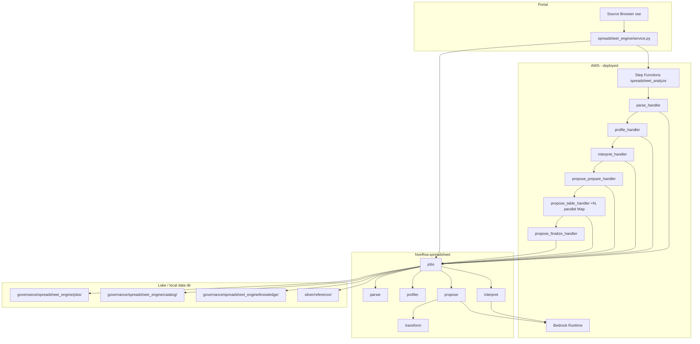

# Spreadsheet Engine

Turn uploaded Excel workbooks (`.xlsx`) into governed reference entities: detect tables, infer schema and business meaning with Bedrock, propose deterministic cleaning steps, and materialize approved tables into `silver/reference/` parquet.

The Spreadsheet Engine is a **virtual source** in the Source Browser (`sse`). It is not a lake connector like QBO or Business Central — it produces reference data that operators review and approve before it lands in the lake.

**Portal route:** `/portal/semantics/source-docs` (default source `sse`)

**Engine code:** `packages/hiveflow-connectors/src/hiveflow/spreadsheet/`

**Portal UI:** `packages/hiveflow-portal/src/hiveflow/dna/web/portal/spreadsheet_engine/`

**Infrastructure:** `infra/spreadsheet_pipeline.py` (Step Functions + Lambdas in `ReportingStack`)

---

## Operator workflow


### 1. Upload and analyze

Upload a workbook from the Source Browser. The portal creates a **job**, stores the file, and **parses sheets**. The operator then selects which sheets to analyze (all sheets are listed as checkboxes, selected by default). After that, the portal starts the `spreadsheet_analyze` Step Functions workflow (or runs the remaining pipeline synchronously in local dev).

Pipeline stages:

| Stage | Job status | What happens |
|---|---|---|
| **Parse** | `parsing` → `awaiting_sheets` | Detect table regions per sheet; list every sheet for operator selection |
| **Select sheets** | `awaiting_sheets` → `parsed` | Operator checks which sheets to analyze; unchecked sheets are skipped |
| **Profile** | `profiling` → `profiled` | Infer column types, null rates, key candidates |
| **Interpret** | `interpreting` → `interpreted` | Bedrock proposes entity name, grain, schema, relationships |
| **Propose** | `proposing` → `ready` | AI cleans each table into a reviewable `clean_goal` |

While analysis runs, the Proposals tab shows a single status message: AI is generating a cleaned proposal of all tables. If the upload replaces an already-approved workbook, the message says approved steps are being applied for final approval.

Poll progress at `GET /api/spreadsheet-engine/status?job_id=…`.

### 2. Review proposals

For each detected table the report includes:

- **Proposed cleaned data** — AI-cleaned preview (`clean_goal`) for shape approval
- **Schema** — column names, types, keys, business descriptions
- **Transformation** — deterministic steps synthesized after the cleaned shape is approved
- **Preview** — source sample plus transformed before/after once steps exist

Approve or reject each step. Rejecting a step includes a details box next to Reject; chat history lives at the bottom of the page. The **Reject** button at the top right of a table removes that table from the review set. Approving the cleaned shape locks the goal and synthesizes steps. Then compare **AI cleaned (goal)** vs **deterministic transform output**, approve or reject with details, then approve the **table**. After cataloguing, DNA Engine proposes joins onto silver and gold from the table’s grain and keys.

Each table has its own `pipeline_stage`:

| Stage | Meaning |
|---|---|
| `clean_review` | Inspect AI cleaned preview; approve or reject with feedback |
| `transform_review` | Compare goal vs deterministic output; approve or reject with feedback |
| `transform_approved` | Transformation saved for reuse; ready to approve table into catalog |
| `catalogued` | Table approved and written to silver/reference |
| `join_review` | Review DNA-proposed joins to silver and existing gold tables |
| `joins_approved` | Selected lake joins accepted |

### 3. Catalog and silver

Approving a table:

1. Writes a **catalog entry** under `governance/spreadsheet_engine/catalog/`
2. Saves or updates a **knowledge entry** (approved transformation + input shape) for future uploads
3. **Materializes** the table to `silver/reference/{entity}/data.parquet`
4. **DNA join proposals** (`hiveflow.dna.join_proposals`) match the table’s grain and keys to:
   - DNA pack silver entities and pack joins
   - lake silver (connector + `silver/reference/`)
   - existing gold outputs (pack outputs, SQL gold `grain_columns`, `gold/dna/` parquet)

The operator selects joins, or re-runs / rejects so DNA can try again. This step does not call Bedrock; matching is deterministic from grain and keys.

Stable catalog IDs use `{source_file_slug}__{entity_name}` (for example `price_list__customers`). Legacy job-bound IDs (`{job_id}__{table_id}`) remain as fallbacks.

### 4. Re-upload (reload)

When a workbook matches a prior catalog entry (by `input_shape.shape_hash` or header compatibility), the portal can link the job to that catalog. On reload:

- **Interpret** validates the new file against the approved transformation — **no Bedrock**
- **Propose** finalizes validation — **no Bedrock**
- If validation passes, the operator completes the reload without re-approving schema or transforms

If validation fails, the operator can request a **schema rewrite** (re-run interpret + propose with AI) or a **transformation rewrite** (re-run propose only).

---

## Architecture



**Package boundaries**

| Package | Responsibility |
|---|---|
| `hiveflow-connectors` | Parse, profile, interpret, propose, transform, jobs, Lambda handlers |
| `hiveflow-platform` | S3/local path helpers (`hiveflow.storage.paths`) |
| `hiveflow-dna` | Join proposals from grain/keys onto silver and gold (`join_proposals.py`) |
| `hiveflow-portal` | Upload UI, Step Functions kickoff, approvals, DNA join review, status API |

Connectors depend on platform only for config and storage paths — the engine does not invent ad-hoc S3 key schemes.

---

## Pipeline modules

### Parse (`parser.py`)

`parse_workbook(path)` loads an `.xlsx` workbook with openpyxl (`data_only=True`) and scans each sheet for contiguous table regions.

Detection rules (simplified):

- Prefer Excel ListObjects (`ws.tables`) and PivotTables (`ws._pivots` location) when the sheet defines them — including several on one sheet
- Then scan leftover area for contiguous regions; split side-by-side tables on fully empty separator columns when those groups overlap on the same rows
- Skip empty rows; treat two consecutive blank rows as end-of-table
- Heuristic regions require at least two data rows and two non-empty columns (named Excel tables may be empty)
- Header row must look like column labels (not report preamble, phone numbers, long prose)
- Headers are normalized to snake_case (`Customer ID` → `customer_id`)

Output: `spreadsheet_engine_parse` JSON with `tables[]` — each table has `table_id`, sheet coordinates (`header_row`, `data_start_row`, `data_end_row`, `min_col`, `max_col`), `headers`, and `sample_rows`.

### Profile (`profiler.py`)

`profile_tables(parse_payload)` computes per-column statistics from parse samples:

- Inferred type (`string`, `number`, `date`, `email`, `currency`, …)
- Null rate, cardinality, unique ratio
- `likely_key` when uniqueness ≥ 95%
- `key_candidates` at table level

### Interpret (`interpret.py`)

`interpret_tables(parse, profile, workbook_path=...)` tries three tiers, each falling back to the next on failure:

1. **Agent pass (`_agent_interpret`)** — when a `workbook_path` is given, a tool-capable loop driven directly by `bedrock-runtime.converse`'s native `toolConfig` (`_agent_runtime.run_bedrock_tool_agent` — plain boto3, no Node/CLI) lets the model inspect the real workbook (`list_sheets`, `get_sheet_map`, `read_range`) before calling `record_interpretation` once per table and `finish`. This replaced an earlier Claude-Agent-SDK/`claude`-CLI version of the same tools: that path was silently failing on every real invocation (Bedrock's own model-invocation logs showed a session-startup probe, an unused session-title call, then a multi-minute silent hang before falling back anyway) — porting the same tool bodies onto Bedrock's own tool-use protocol keeps the capability without the CLI subprocess to hang.
2. **Single-shot (`_default_invoke`)** — calls Bedrock (Claude Haiku by default) once with profiling stats and sample rows, no tools. Used when there's no `workbook_path`, or the agent pass raises.
3. **Heuristic fallback** — derives entity name from the sheet title and schema from profiler output when Bedrock is unavailable or returns invalid JSON (`invoke=False` in tests skips the API call entirely).

All three tiers return entity proposals with the same shape: `entity_name`, `purpose`, `grain`, `confidence`, `schema`, `relationships`.

### Propose (`propose.py`, `synthesize.py`, `sample.py`)

`propose_transform_for_table(...)` attaches a **cleaned data goal** to one interpreted table for operator review; `propose_transforms(...)`/`propose_transforms_for_report(...)` loop that sequentially over every table for the local/dev pipeline. Transform steps are synthesized **after** the cleaned shape is approved.

The deployed pipeline does **not** run tables sequentially in one Lambda — a table's AI call can take real time, and running every table in one 900s Lambda invocation would time out on any workbook with more than a handful of tables. Instead a Step Functions **Map state** fans tables out to parallel `propose_table_handler` invocations (`run_propose_table`, `jobs.py`), bookended by `run_propose_prepare` (flips the job to `proposing`, lists `table_ids`) and `run_propose_finalize` (aggregates each table's S3 output into the final `report.json`, flips the job to `ready`). Per-table branches only ever write their own `governance/spreadsheet_engine/jobs/{job_id}/tables/{table_id}.json` key — never job.json — so concurrent branches can't race on the shared job record. `jobs.propose_table_progress` reads that same per-table state (a table's JSON exists from the interpret stage already, so "has `clean_goal`" — not existence — is the ready signal) to give the portal UI a live per-table checklist instead of one job-wide spinner.

Despite running on the interpret/propose **container-image** Lambdas (Node + the `claude` CLI, `HIVEFLOW_AGENT_RUNTIME=sdk`), the propose stage's oracle-clean and transform-synthesis calls (`synthesize.py`, via `_agent_runtime.text_invoke`) always go straight to a plain single-shot `converse` call — confirmed via Bedrock's own model-invocation logs that routing a single-shot, no-tools call through the Agent SDK still pays for a full Claude Code CLI session (model-availability probes + an unused "name this session" call) before an internal failure fell back to `converse` anyway. `text_invoke` skips straight there now, so a table's real cost is one Bedrock call, not one CLI session plus a fallback.

1. **AI clean (oracle)** — sample rows are cleaned into `clean_goal` (`headers`, `rows`, `grain`) with `clean_shape_status=pending_review`.
2. **Operator review** — approve the cleaned preview, or reject with feedback to re-clean.
3. **Synthesize on shape approve** — `approve_clean_shape` locks the goal as final and asks the model to reverse-engineer deterministic steps (`group_rows`, `filter_rows`, `cast`, …) that recreate it. Steps are verified against the goal before `transformation_status=pending_review`.
4. **Catalog / knowledge reuse** — when a linked catalog or knowledge entry matches `input_shape` (≥ 0.8), prior steps are reused and the clean shape is treated as already approved.

`extract_table_sample` reads rows up to a byte budget (default 512 MiB). Oracle prompts use a separate, smaller cap (default 2 MiB) with windowed excerpts via `select_oracle_windows`.

Operator workflow on the Review tab (per table):

1. Review **Proposed cleaned data** → approve / reject with feedback
2. Review **goal vs deterministic output** → approve / reject with feedback
3. Approve table → catalog + silver
4. Table chips show stage badges (`Clean review`, `Transform review`, …)

### Transform (`transform.py`)

Transformations are versioned JSON specs applied deterministically to row data:

| Op | Purpose |
|---|---|
| `rename_columns` | Map source headers to schema column names |
| `cast` | Coerce columns to `string`, `number`, `date`, `datetime`, `boolean` |
| `group_rows` | Merge continuation rows (blank key) into the preceding key row |
| `filter_rows` | Keep rows matching `col != null`, `col != 'Grand Total'`, `AND`/`OR`, or `col not in ('NULL', 'Grand Total')`. The string `NULL` counts as null. |
| `derive_column` | Add computed columns (`first_name + ' ' + last_name`) |

`compute_input_shape` hashes sheet name + normalized headers into `shape_hash` for catalog matching. `apply_transformation` runs steps and projects to `output_shape.schema` when present.

### Materialize (`materialize.py`)

On table approval, `materialize_approved_table` re-reads the full workbook region, applies the approved transformation, and writes parquet to:

```
silver/reference/{entity}/data.parquet
```

Catalog entries record `silver_source`, `silver_entity`, `silver_parquet_key`, and `silver_row_count`.

### DNA join proposals (`hiveflow.dna.join_proposals`)

After a table is catalogued, the portal asks DNA Engine to propose joins. Matching is deterministic (no Bedrock):

- Source **grain** tokens and **keys** (schema `is_key` / `is_foreign_key`, profiler `likely_key`)
- Silver: production pack entities (`grain` + `primary_key`), pack `joins`, lake silver for the connector, and `silver/reference/`
- Gold: pack outputs, SQL pack gold transforms (`grain_columns`), and `gold/dna/` parquet

Proposed joins are stored on the job table (`join_proposals`, `join_status`) for operator approval.

### Jobs (`jobs.py`)

Central orchestration and persistence:

- `create_job`, `store_upload`, `run_parse`, `run_profile`, `run_interpret`, `run_propose`
- `run_pipeline` — synchronous full pipeline for local dev (`pipeline_handler`)
- Catalog: `save_catalog_entry`, `load_catalog_entry`, `list_catalog_entries`
- Knowledge: `save_knowledge_entry`, `load_knowledge_matches`
- Approvals: `approve_clean_shape`, `approve_transformation`, `approve_table`, `complete_reload`
- Reload: `run_reload_prepare`, `run_reload_finalize`, `request_schema_rewrite`

Lambda handlers in `handlers.py` wrap the `run_*` functions for Step Functions.

---

## Storage layout

All paths are defined in `hiveflow.storage.paths` under `governance/spreadsheet_engine/`:

```
governance/spreadsheet_engine/
  jobs/{job_id}/
    job.json              # job metadata and status
    upload/{filename}     # original .xlsx
    parse.json            # parse output
    profile.json          # profile output
    report.json           # interpreted + proposed tables
    tables/{table_id}.json
  catalog/{catalog_id}.json
  knowledge/{knowledge_id}.json
```

**Job statuses:** `uploaded` → `parsing` → `awaiting_sheets` → `parsed` → `profiling` → `profiled` → `interpreting` → `interpreted` → `proposing` → `ready` (or `error`).

With `HIVEFLOW_S3_BUCKET` set, artifacts are written to S3. Otherwise `HIVEFLOW_DATA_DIR` (default `data/`) is used for local development.

---

## Environment variables

| Variable | Default | Purpose |
|---|---|---|
| `HIVEFLOW_S3_BUCKET` | (empty) | S3 bucket for job artifacts; empty → local `HIVEFLOW_DATA_DIR` |
| `HIVEFLOW_DATA_DIR` | `data` | Local filesystem root when not using S3 |
| `HIVEFLOW_BEDROCK_MODEL_ID` | `us.anthropic.claude-haiku-4-5-20251001-v1:0` | Model for interpret / propose / synthesize |
| `HIVEFLOW_SPREADSHEET_STATE_MACHINE_ARN` | (derived) | Override Step Functions ARN in portal |
| `HIVEFLOW_SPREADSHEET_MAX_SAMPLE_BYTES` | `536870912` (512 MiB) | Max raw sample size for induction |
| `HIVEFLOW_SPREADSHEET_ORACLE_PROMPT_BYTES` | `2097152` (2 MiB) | Max bytes sent to oracle / synthesize prompts |
| `AWS_REGION` / `AWS_DEFAULT_REGION` | `us-east-2` | Bedrock and Step Functions region |

---

## Local development

```powershell
# From repo root — editable install of all packages
.\scripts\install_dev.ps1

# Run tests (no Bedrock; invoke=False in unit tests)
cd packages/hiveflow-connectors
pytest tests/test_spreadsheet_engine.py -v
```

Minimal local pipeline:

```python
import os
from pathlib import Path

os.environ["HIVEFLOW_DATA_DIR"] = "/tmp/hiveflow-data"

from hiveflow.spreadsheet.jobs import (
    create_job, store_upload, run_pipeline, load_report,
)

workbook = Path("sample.xlsx")
job = create_job(filename=workbook.name, username="dev")
store_upload(job["job_id"], filename=workbook.name, body=workbook.read_bytes())
run_pipeline(job["job_id"])
report = load_report(job["job_id"])
```

Or call stages individually: `run_parse` → `run_profile` → `run_interpret` → `run_propose`.

Use `hiveflow.spreadsheet.handlers.pipeline_handler` as a single Lambda entry point for dev convenience.

---

## Deployed infrastructure

`create_spreadsheet_pipeline` in `infra/spreadsheet_pipeline.py` provisions:

| Resource | Handler / name |
|---|---|
| Parse Lambda | `hiveflow.spreadsheet.handlers.parse_handler` |
| Profile Lambda | `hiveflow.spreadsheet.handlers.profile_handler` |
| Interpret Lambda | `hiveflow.spreadsheet.handlers.interpret_handler` |
| Propose-prepare Lambda | `hiveflow.spreadsheet.handlers.propose_prepare_handler` (plain zip — no Bedrock) |
| Propose-table Lambda | `hiveflow.spreadsheet.handlers.propose_table_handler` (Agent SDK container image; one invocation per table, fanned out by the Map state below) |
| Propose-finalize Lambda | `hiveflow.spreadsheet.handlers.propose_finalize_handler` (plain zip — no Bedrock) |
| State machine | `{company}-{env}-all-spreadsheet_analyze` |

Chain: **Parse → Profile → Interpret → Propose-prepare → Map(Propose-table, max concurrency 4) → Propose-finalize**. Interpret and propose-table Lambdas need Bedrock invoke permissions. All Lambdas read/write the data bucket.

---

## Portal API

| Endpoint | Method | Purpose |
|---|---|---|
| `/portal/semantics/source-docs` | GET/POST | Main UI (source `sse`); form actions for upload, sheet selection, approve, reject, chat |
| `/api/spreadsheet-engine/status` | GET | Job status and pipeline stage progress (`job_id` query param) |

Form actions (POST to the source-docs page) include upload, approve/reject transformation, approve table, approve/reject/refresh lake joins, complete reload, schema rewrite, and table chat. See `spreadsheet_engine/service.py` for the full action surface.

---

## Design notes

**Deterministic replay.** Approved transformations are stored in the catalog and knowledge base. Re-uploads validate against them without calling AI when shapes match. Silver materialization always replays the stored steps — Bedrock is not invoked after approval.

**Messy spreadsheets.** Price lists and similar exports often use grouped rows (item on one line, unit of measure and price on the next). The profiler flags these via `key_candidates` with high null rates; `needs_structural_cleaning` triggers the induce path (`group_rows` + `coalesce_columns`).

**Source Browser integration.** `sse` is registered as a virtual reference source alongside connector sources (`dbc`, etc.). Spreadsheet Engine does not use the MS Learn source-docs gold pipeline — it owns its catalog under `governance/spreadsheet_engine/`.

**Tests.** `packages/hiveflow-connectors/tests/test_spreadsheet_engine.py` covers parsing (including report preambles), profiling, transforms, catalog approval, silver materialization, reload validation, and grouped-row induction. Portal rendering tests live in `packages/hiveflow-portal/tests/test_spreadsheet_engine.py`.
